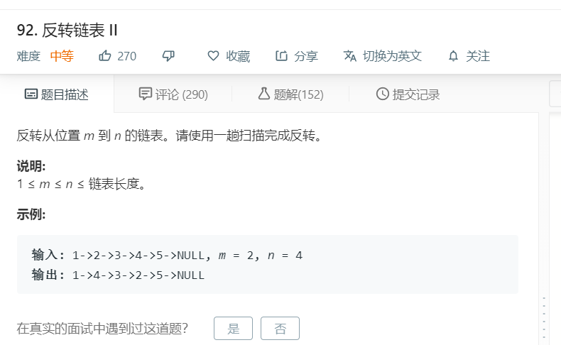

# 92.反转链表II
  

```
/**
 * Definition for singly-linked list.
 * function ListNode(val) {
 *     this.val = val;
 *     this.next = null;
 * }
 */
/**
 * @param {ListNode} head
 * @param {number} m
 * @param {number} n
 * @return {ListNode}
 */
var reverseBetween = function(head, m, n) {
    let temp = [];
    while(head){
        temp.push(head);
        head = head.next;
    }

    let mid = Math.floor((n-m)/2);
    console.log(mid)
    for(let i=0;i<=mid;i++){
        [temp[m+i-1],temp[n-i-1]] = [temp[n-i-1],temp[m+i-1]];
    }

    console.log(temp);

    for(let i=0;i<temp.length-1;i++){
        temp[i].next = temp[i+1];
    }
    temp[temp.length-1].next = null;

    return temp[0];
};
```