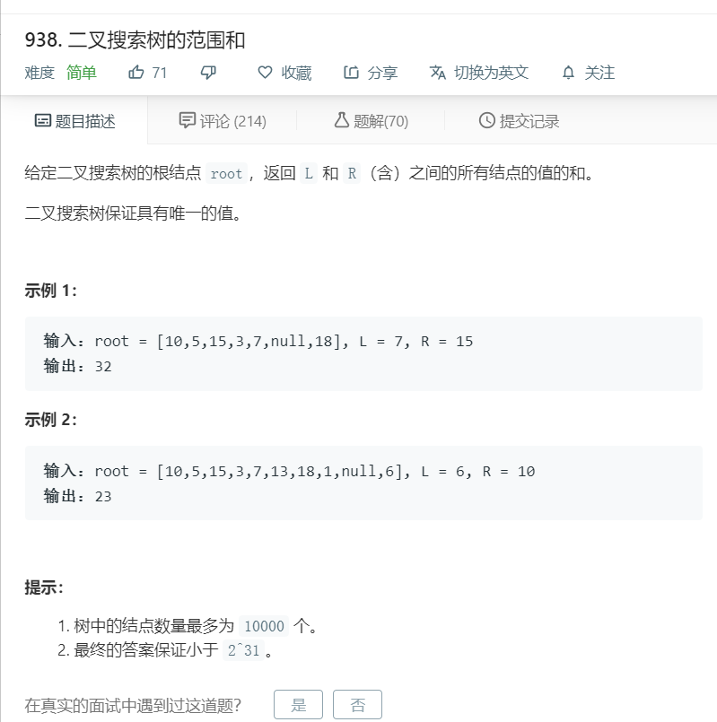

# 938.二叉搜索树的范围和
  

```
/**
 * Definition for a binary tree node.
 * function TreeNode(val) {
 *     this.val = val;
 *     this.left = this.right = null;
 * }
 */
/**
 * @param {TreeNode} root
 * @param {number} L
 * @param {number} R
 * @return {number}
 */
var rangeSumBST = function(root, L, R) {
    let temp = [],result=0;
    function mid(r){
        if(!r){
            return;
        }

        mid(r.left);
        temp.push(r.val);
        mid(r.right);
    }
    mid(root);

    let one = temp.indexOf(L);
    let two = temp.indexOf(R);
    for(let i=one;i<=two;i++){
        result += temp[i];
    }

    return result;
};
```