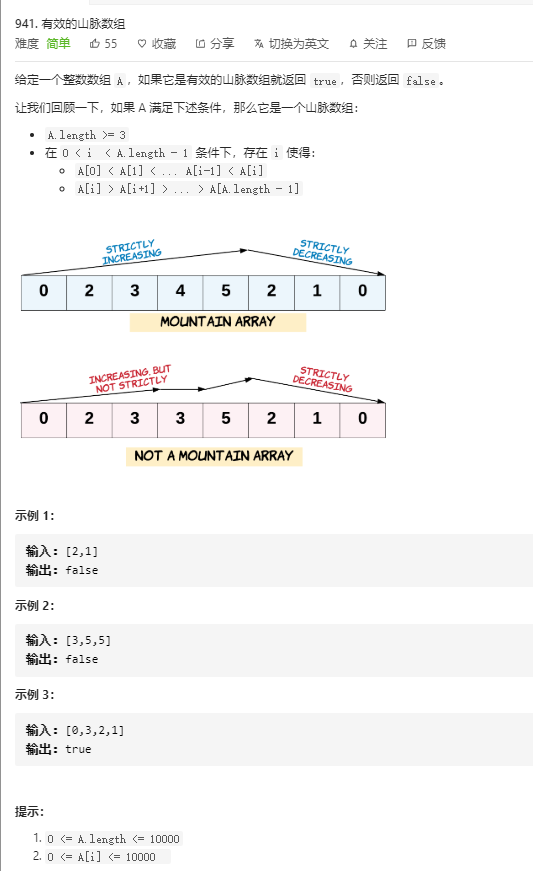

# 941.有效的山脉数组  
  

```
/**
 * @param {number[]} A
 * @return {boolean}
 */
var validMountainArray = function(A) {
    let max = Math.max(...A);

    let pos = A.indexOf(max);

    if (pos === 0 || pos === A.length -1){
        return false;
    }

    for (let i=1;i<A.length -1;i++) {
        if (i < pos && A[i-1] >= A[i]) {
            return false;
        }

        if (i >= pos && A[i+1] >= A[i]) {
            return false;
        }
    }

    return true;
};
```