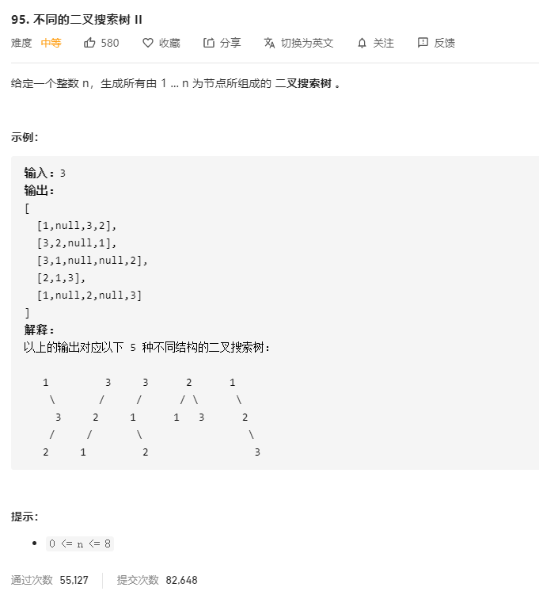

# 95.不同的二叉搜索树II
  

```
/**
 * Definition for a binary tree node.
 * function TreeNode(val) {
 *     this.val = val;
 *     this.left = this.right = null;
 * }
 */
/**
 * @param {number} n
 * @return {TreeNode[]}
 */
var generateTrees = function(n) {
    if(n < 1) {
        return [];
    }
    const mid = (start, end) => {
        const list = [];

        if(start > end) {
            list.push(null);
            return list;
        }

        for(let i=start;i<=end;i++) {
            const left = mid(start, i-1);
            const right = mid(i+1, end);

            for(let e=0;e<left.length;e++) {
                for(let j=0;j<right.length;j++) {
                    const r = new TreeNode(i);
                    r.left = left[e];
                    r.right = right[j];
                    list.push(r);
                }
            }
        }

        return list;
    }

    return mid(1,n);
};
```