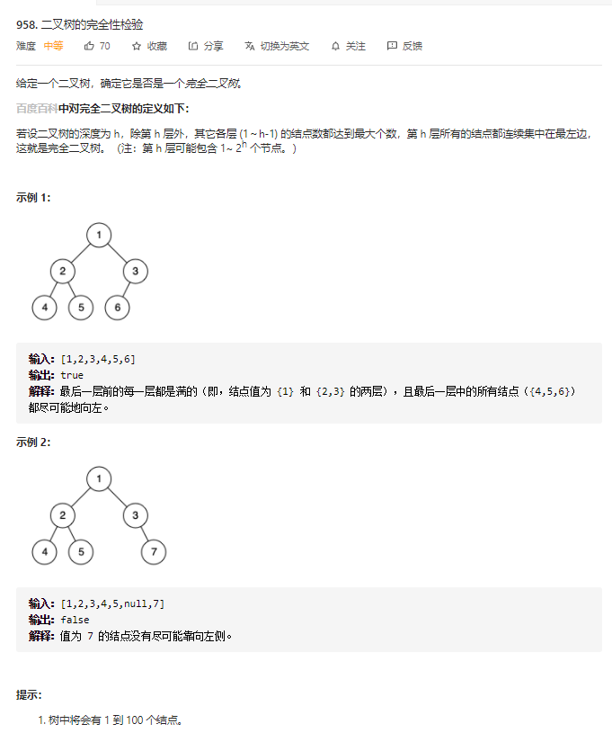

# 958.二叉树的完全性检验
  

```
/**
 * Definition for a binary tree node.
 * function TreeNode(val) {
 *     this.val = val;
 *     this.left = this.right = null;
 * }
 */
/**
 * @param {TreeNode} root
 * @return {boolean}
 */
var isCompleteTree = function(root) {
    let result = true, temp = [];
    const mid = (r, hei) => {
        if (r) {
            if (!r.left && r.right) {
                result = false;
                return;
            }
            if (!temp[hei]) {
                temp[hei] = [];
            }

            if (r === '*') {
                temp[hei].push('*');
                return ;
            } else {
                temp[hei].push(r.val);
            }

            mid(r.left, hei + 1);
            mid(r.right ? r.right : '*', hei + 1);
        }
    }

    mid(root, 0);

    if (!result) {
        return result;
    }

    console.log(temp)

    let start = 1;
    for (let i=0;i<temp.length - 1;i++) {
        for(let j=temp[i].length-1;j>-1;j--) {
            if (temp[i][j] === '*') {
                temp[i].splice(j,1);
            } else {
                break;
            }
        }
        if (i < temp.length-2 && temp[i].length !== start) {
            return false;
        }
        let now = temp[i].join('');
        // console.log(now)
        if (now.includes('*')) {
            return false;
        }
        start *= 2;
    }

    return true;
};
```

```
/**
 * Definition for a binary tree node.
 * function TreeNode(val) {
 *     this.val = val;
 *     this.left = this.right = null;
 * }
 */
/**
 * @param {TreeNode} root
 * @return {boolean}
 */
var isCompleteTree = function(root) {
    if (!root) {
        return true;
    }

    let queue = [root];
    let len = queue.length;

    while(len) {
        while(len--) {
            let now = queue.shift();
            if (!now) {
                return !queue.some(i => i);
            }

            if(!now.left && now.right) {
                return false;
            }

            queue.push(now.left, now.right);
        }
        len = queue.length;
    }

    return true;
};
```