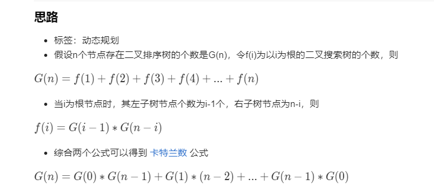

# 96.不同的二叉搜索树
  

  


```
/**
 * @param {number} n
 * @return {number}
 */
var numTrees = function(n) {
    if(n < 1) {
        return 0;
    }

    const res = new Array(n + 1).fill(0);

    res[0] = 1;
    res[1] = 1;

    for(let i=2;i<=n;i++) {
        for(let j=1;j<i+1;j++) {
            res[i] += res[j-1] * res[i-j];
        }
    }

    return res[n];
};
```