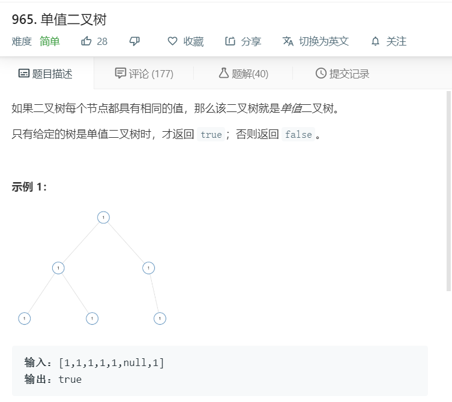

# 965.单值二叉树
  

```
/**
 * Definition for a binary tree node.
 * function TreeNode(val) {
 *     this.val = val;
 *     this.left = this.right = null;
 * }
 */
/**
 * @param {TreeNode} root
 * @return {boolean}
 */
var isUnivalTree = function(root) {
    let temp = [];
    function mid(r){
        if(r != null){
            temp.push(r.val);
            mid(r.left);
            mid(r.right);
        }
    }
    mid(root);
    let result = [...new Set(temp)];
    if(result.length <=1){
        return true;
    }
    return false;
};
```