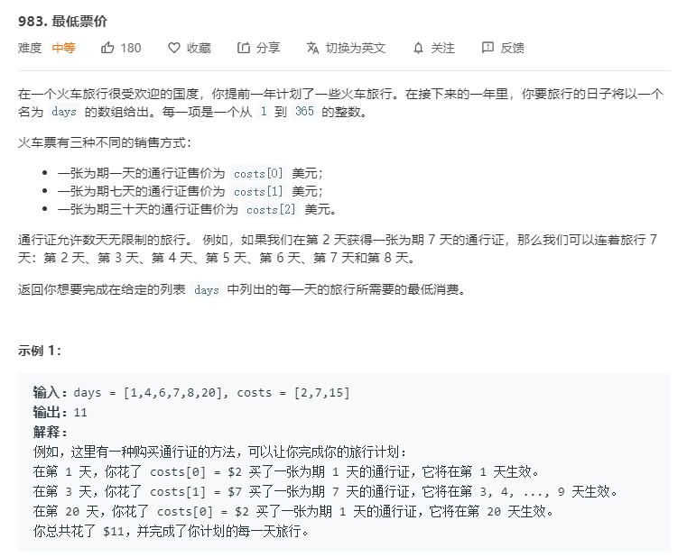
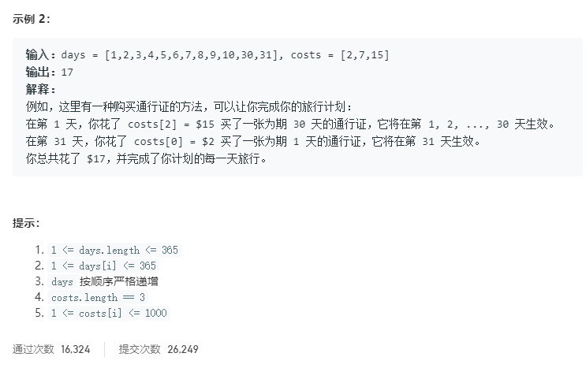
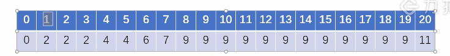

# 983.最低票价
  

  

  

```
/**
 * @param {number[]} days
 * @param {number[]} costs
 * @return {number}
 */
var mincostTickets = function(days, costs) {
    let result = new Array(days[days.length - 1] + 1).fill(0);

    for(let i = 1;i <= days[days.length - 1];i++){
        if(days.indexOf(i) < 0){
            result[i] = result[i - 1];
        }else {
            result[i] = Math.min(result[Math.max(0,i - 1)] + costs[0],
                                result[Math.max(0,i - 7)] + costs[1],
                                result[Math.max(0,i - 30)] + costs[2]);
        }
    }

    console.log(result);
    return result.pop();
};
```