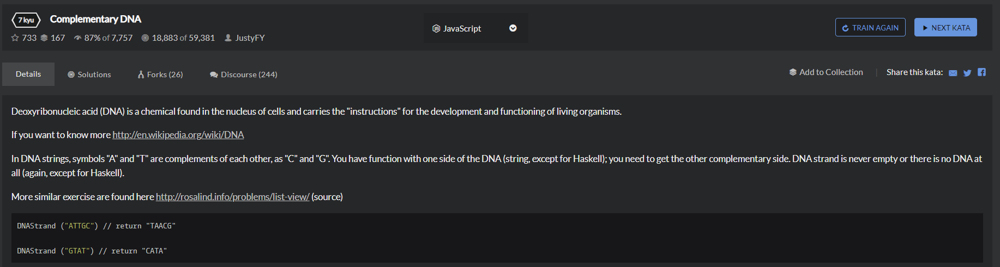

# complementary-DNA
  

## 暴力破解
```
function DNAStrand(dna){
  //your code here
  let res=[]
  for(let i=0;i<dna.length;i++){
    if(dna[i]==='A'){res.push(dna[i].replace('A','T'))}
    else if(dna[i]==='T'){res.push(dna[i].replace('T','A'))}
    else if(dna[i]==='C'){res.push(dna[i].replace('C','G'))}
    else{res.push(dna[i].replace('G','C'))}
  }
  
  return res.join('');
}
```

## 利用正则
```
function DNAStrand(dna){
    return dna.replace(/./g,function(c){
        return DNAStrand.pairs[c];
    })
}

DNAStrand.pairs = {
  A: 'T',
  T: 'A',
  C: 'G',
  G: 'C',
}
```