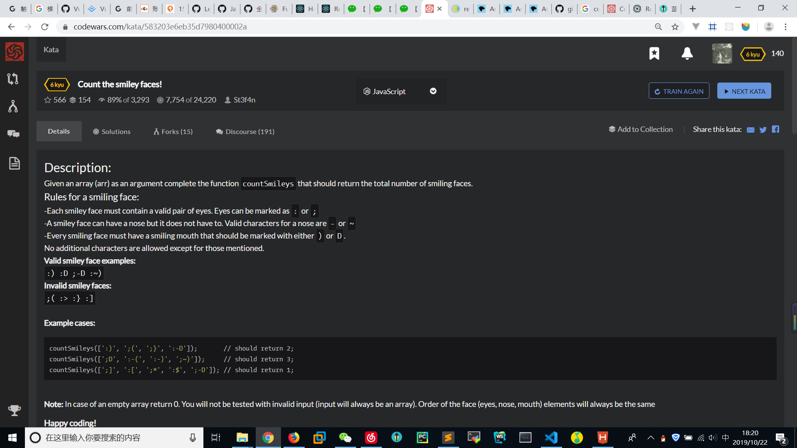

# Count-the-smiley-faces
  
```
function countSmileys(arr) {
    if(arr.length <= 0){
        return 0;
    }
    
    let count = [];
    let only = [":",";","-","~",")","D"];
    let eyes = [":",";"];
    let nose = ["-","~"];
    let mouth = [")","D"];

    for(let i=0;i<arr.length;i++){
        let temp = arr[i].split('');
        
        if(temp.length===2 && eyes.includes(temp[0]) && mouth.includes(temp[1])){
            count[i] = 1;
        }
        else if(temp.length===3 && eyes.includes(temp[0]) && nose.includes(temp[1]) && mouth.includes(temp[2])){
            count[i] = 1;
        }
        else{
            count[i] = 0; 
        }


    }

    let result = 0;
    
    for(let i=0;i<count.length;i++){
        result += count[i];
    }
    
    return result;
}
```
```
function countSmileys(arr){
    return arr.filter(x=> /^[:;][-~]?[)D]$/.test(x)).length;
}
```