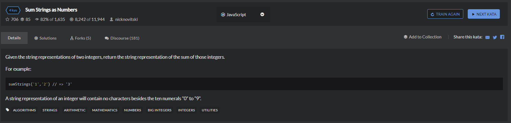

# Sum Strings as Numbers
  

```
function sumStrings(a,b) { 
    if(a==='' && b===''){
        return null;
    }
    if(a==='' && b!=null){
        return b.toString();
    }
    if(a!=null && b===''){
        return a.toString();
    }

    let tempa = a.split(''),
        tempb = b.split(''),
        result = [],
        longnum = 0,
        tempresult = [];

    if(tempa.length > tempb.length){
        longnum = tempa.length+1;
        result.length = longnum - 1;
        tempresult.length = longnum;
    }else{
        longnum = tempb.length+1;
        result.length = longnum - 1;
        tempresult.length = longnum;
    }

    for(let i=0;i<result.length;i++){
        result[i] = 0;
    }
    for(let i=0;i<tempresult.length;i++){
        tempresult[i]=0;
    }
    longnum = result.length;

    while(tempb.length || tempa.length){
        if(tempa[tempa.length-1]== null && tempb[tempb.length-1] != ''){
           result[longnum-1] = parseInt(tempb.pop(),10);
        }else if(tempa[tempa.length-1] != '' && tempb[tempb.length-1] == null){
            result[longnum-1] = parseInt(tempa.pop(),10);
        }else{
            let onlytemp = parseInt(tempa.pop(),10)+(parseInt(tempb.pop(),10));
            if(onlytemp>=10){
                result[longnum-1] = onlytemp-10;
                tempresult[longnum-1] = 1;
            } else{
                result[longnum-1] = onlytemp;
            }
        }

        longnum--;

    }

    for(let i=1;i<result.length;i++){
        if(tempresult[i] === 1){
            if((result[i-1]+tempresult[i])>=10){
                tempresult[i-1] = 1;
            }
        }
    }
    
    for(let i=0;i<tempresult.length;i++){
        if(result.length-1-i>=0){
            if(tempresult[i]!=null){
                if(tempresult[tempresult.length-i-1]+result[result.length-1-i] >= 10){
                    tempresult[tempresult.length-i-1] =  tempresult[tempresult.length-i-1]+result[result.length-1-i]-10;
                }else{
                    tempresult[tempresult.length-i-1] =  tempresult[tempresult.length-i-1]+result[result.length-1-i];
                }
            }else{
                tempresult[tempresult.length-i-1] = result[i];
            }
        }
       
    }

    let first = [];
    for(let i=0;i<tempresult.length;i++){
        while(tempresult[i]!=0){
            first.push(tempresult.slice(i,tempresult.length));
            break;
        }
    }

    return first[0].join('');
}
```
```
function sumStrings(a,b){
    var res = '',c=0;
    a = a.split('');
    b = b.split('');
    while(a.length || b.length || c){
        c+= ~~a.pop() + ~~b.pop();
        res = c % 10 + res;
        c = c > 9;
    }
    return res.replace(/^0+/,'');
}
```
~~:**将操作数转化为 32 位有符号整数**  
```
~~ '1' // 1
```
正则 ：  

- \+ 至少一个，相当于{1,}

```
String.prototype.reverse = function() {
  return this.split('').reverse().join('');
}

function sumStrings(a,b) {
  a = a.reverse(); b = b.reverse();
  var carry = 0;
  var index = 0;
  var sumDigits = [];
  while (index < a.length || index < b.length || carry != 0) {
    var aDigit = index < a.length ? parseInt(a[index]) : 0;
    var bDigit = index < b.length ? parseInt(b[index]) : 0;
    var digitSum = aDigit + bDigit + carry;
    sumDigits.push((digitSum % 10).toString());
    carry = Math.floor(digitSum / 10);
    index++;
  }
  sumDigits.reverse();
  while (sumDigits[0] == '0') sumDigits.shift();
  return sumDigits.join('');
}
```