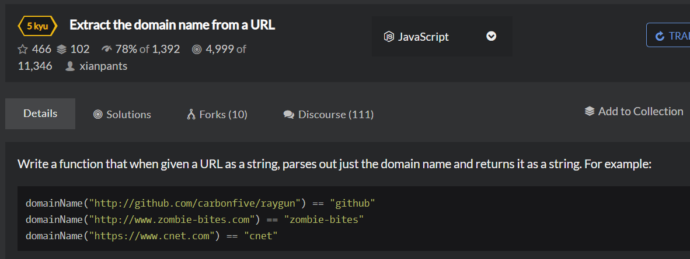

# Extract-the-domain-name-from-a-URL
  

```
function domainName(url){
    //your code here
    let temp = url.split('/');
    if(temp[0]==='http:'){
        let result = temp[2].split('.');
        if(result.includes('www')){
            return result[1];
        }else{
            return result[0];
        } 
    }
    else if(temp[0]==='https:'){
        let result = temp[2].split('.');
        if(result.includes('www')){
            return result[1];
        }else{
            return result[0];
        } 
    }
    else{
        let result = temp[0].split('.');
        if(result.includes('www')){
            return result[1];
        }else{
            return result[0];
        }  
    }

  }
```

```
function domainName(url){
    url = url.replace("https://",'');
    url = url.replace("http://",'');
    url = url.replace("www",'');
    return url.split('.')[0];
}
```
```
function domainName(url){
    return url.match(/(?:http(?:s)?:\/\/)?(?:w{3}\.)?([^\.]+)/i)[1];
}
```
?:和?=都用于子表达式里面，?:表示匹配且获取，?=表示匹配但不获取。
?表示0个或1个
{n}表示正好出现n次  
match():可以根据正则表达式，从一个字符串中将符合条件的内容提取出来;  
\+:表示 至少一个