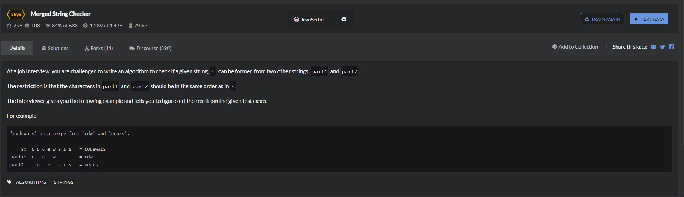

# Merged-String-Checker


```
function isMerge(s, part1, part2) {
    

    let temp1 = part1.split('');
    let temp2 = part2.split('');
    let temps = s.split('');
    if(temps.length>0){
        while(temps.length>0){
            if(temps[temps.length-1]===temp1[temp1.length-1]){
                temps.pop();
                temp1.pop();
            }else if(temps[temps.length-1]===temp2[temp2.length-1]){
                temps.pop();
                temp2.pop();
            }else{
                return false;
            }
        }
        
        return true;
    }else if(temps.length === 0 && temp1.length === 0 && temp2.length === 0){
        return true;
    }else{
        return false;
    }
    

  }
```

```
function isMerge(s,part1,part2){
    return !s ? !(part1 || part2) : 
    s[0] == part1[0] && isMerge(s.slice(1),part1.slice(1),part2) || 
    s[0] == part2[0] && isMerge(s.slice(1),part1,part2.slice(1));
}
```