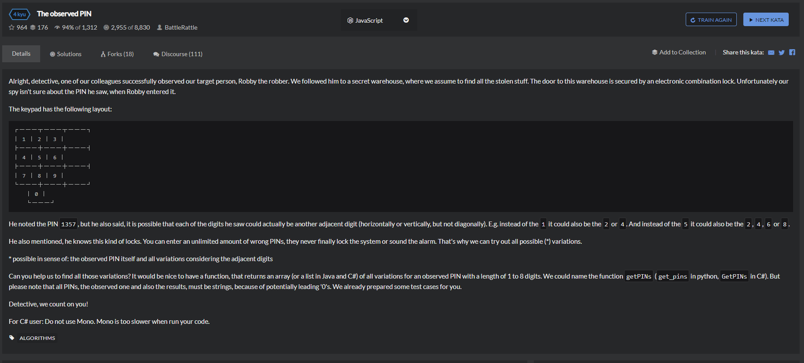

# The observed PIN


## 自己的解答
```
function getPINs(observed) {
    // TODO: This is your job, detective!
     let temp = observed.split('');
    let tempArray = {
        '1':['1','2','4'],
        '2':['1','2','3','5'],
        '3':['2','3','6'],
        '4':['1','4','5','7'],
        '5':['2','4','5','6','8'],
        '6':['3','5','6','9'],
        '7':['4','7','8'],
        '8':['5','7','8','9','0'],
        '9':['6','8','9'],
        '0':['8','0']
    };
    let templength = temp.length;
    let onlytemp = [];
    for(let i=0;i<temp.length;i++){
        onlytemp.push(tempArray[temp[i]]);
    }

    console.log(temp);
    console.log(onlytemp);

    if(templength === 1){
        return tempArray[temp];
    }


    while(templength-- > 1){
        let sun = [];
        for(let i=0;i<onlytemp[0].length;i++){
            for(let j=0;j<onlytemp[1].length;j++){
                sun.push(onlytemp[0][i]+onlytemp[1][j]);
            }
        }
        onlytemp[1] = sun;
        onlytemp.shift();
        console.log(onlytemp);
    }
    return onlytemp[0];
}
```
## 觉得的较优解
````
function getPINs(observed){
    return observed.split('').map(t => ({
        '0': [ '0', '8' ],
        '1': [ '1', '2', '4' ],
        '2': [ '1', '2', '3', '5' ],
        '3': [ '2', '3', '6' ],
        '4': [ '1', '4', '5', '7' ],
        '5': [ '2', '4', '5', '6', '8' ],
        '6': [ '3', '5', '6', '9' ],
        '7': [ '4', '7', '8' ],
        '8': [ '5', '7', '8', '9', '0' ],
        '9': [ '6', '8', '9' ]
    }[t])).reduce((pre,cur) => [].concat.apply([],pre.map(t => cur.map(g => t + g))));
}
```
## 理解错误时的做法，其中对于多重循环的利用，小小记录下
```
function getPINs(observed) {
    // TODO: This is your job, detective!
    let temp = observed.split('');
    let tempArray = {
        '1':['2','4'],
        '2':['1','3','5'],
        '3':['2','6'],
        '4':['1','5','7'],
        '5':['2','4','6','8'],
        '6':['3','5','9'],
        '7':['4','8'],
        '8':['5','7','9','0'],
        '9':['6','8'],
        '0':['8']
    };
    let templength = temp.length;
    let onlytemp = [];
    for(let i=0;i<temp.length;i++){
        if(!onlytemp.includes(temp[i])){
            onlytemp.push(temp[i]);
        }
    }

    let lastArr = onlytemp.slice(0);

    
    for(let i=0;i<onlytemp.length;i++){
        let forfu = tempArray[onlytemp[i]];
        for(let j=0;j<forfu.length;j++){
            if(!lastArr.includes(forfu[j])){
                lastArr.push(forfu[j]);
            }
        }
    }    

   

    if(templength === 1){
        return lastArr;
    }
    let addnum = Math.pow(lastArr.length,templength);
    let addarr = []
    for(let i=0;i<addnum;i++){
        addarr[i] = [];
    }
    // console.log(addarr);

    // console.log(templength);
    // console.log(lastArr);
    let onlytwo = lastArr.slice(0);
    // console.log(onlytwo);

    while(templength-- > 1){
        let forsun = [],suntwo=[];
        for(let i=0;i<lastArr.length;i++){
            for(let j=0;j<onlytwo.length;j++){
                forsun.push(lastArr[i]+onlytwo[j]);
            }
            
            suntwo.push(forsun);
        }
        // console.log(forsun);
        lastArr = forsun.slice(0);
        console.log(lastArr);
    }
    console.log(lastArr.length)
    return lastArr;
}

getPINs('46');
```