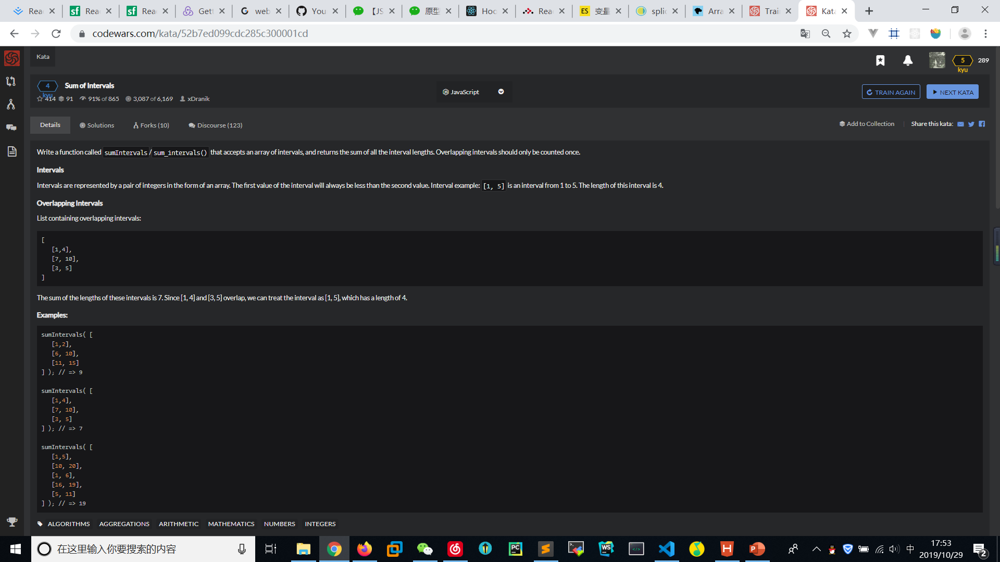

# Sum of Intervals
  

1. 自己完成的
```
function sumIntervals(intervals){
    //TODO
    for(let i=0;i<intervals.length-1;i++){
        let fori = 0;
        for(let j=i+1;j<intervals.length;j++){
            if((intervals[j][0]-intervals[i][0]>=0  && intervals[i][1]-intervals[j][1] >= 0) || 
            (intervals[i][0]==intervals[j][0] && intervals[i][1]==intervals[j][1])){
                intervals.splice(j,1);
                j = j - 1;
            }else if(intervals[j][0]-intervals[i][0]<=0  && intervals[i][1]-intervals[j][1] <= 0){
                intervals.splice(i,1);
                fori += 1;
                break;
            }
            else if(intervals[i][1] > intervals[j][0] && intervals[i][1] < intervals[j][1]){
                intervals[i][1] = intervals[j][1];
                intervals.splice(j,1);
                j = j - 1;
            }else{
                continue;
            }
        }
        if(fori>0){
            i = i-1;
        }
    }

    let result = 0;
    for(let i=0;i<intervals.length;i++){
        result += (intervals[i][1]-intervals[i][0]);
    }

    console.log(intervals);
    console.log(result);
    return result;
  }

  var test1 = [ [ 144, 431 ],
  [ -45, 288 ],
  [ 9, 34 ],
  [ -3, 266 ],
  [ -59, 133 ],
  [ -316, -307 ],
  [ 384, 453 ],
  [ -314, 57 ],
  [ -97, -61 ],
  [ -396, -6 ],
  [ -37, 19 ],
  [ -409, 453 ],
  [ -122, 301 ] ];
  sumIntervals(test1);
```

2. 较优解

```
function sumIntervals(intervals){
    var numbers = [];
    intervals.forEach(function (interval){
        for(var i=interval[0];i<interval[1];i++){
            if(numbers.indexOf(i)==-1)numbers.push(i);
        }
    });
    return numbers.length;
}
```