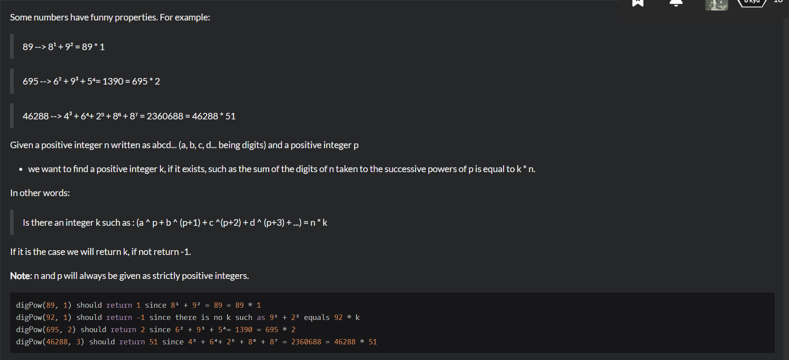
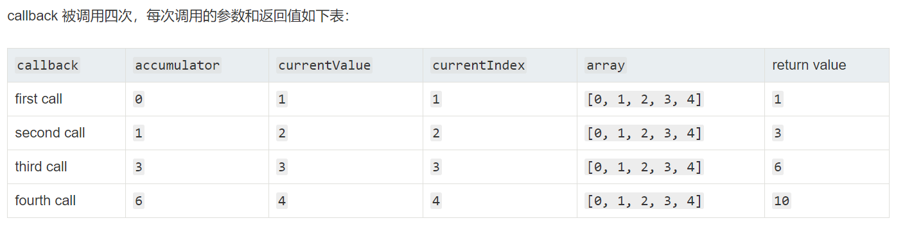

# Playing-with-digits



```
function digPow(n,p){
    let string = n.toString();
    let len = string.length;
    let result = 0;
    for(let i=0;i<len;i++){
        let numberser = parseInt(string.charAt(i),10);
        result +=Math.pow(numberser,p+i);
    }

    let x = Math.pow(n,p);
    if(result === x){
        return p;
    }else if(result%n === 0){
        return result/n;
    }else{
        return -1;
    }
}
```
charAt() 方法从一个字符串中返回指定的字符。
Math.pow() 函数返回基数（base）的指数（exponent）次幂，即 baseexponent。

```
function digPow(n,p){
    var x = String(n).split("").reduce((s,d,i)=>s+Math.pow(d,p+i),0)

    return x%n ? -1 : x/n
}
```

reduce的四个参数：  
- accumulator:累计器
- currentValue:当前值
- currentIndex:当前索引
- array:数组

```
[0, 1, 2, 3, 4].reduce(function(accumulator, currentValue, currentIndex, array){
  return accumulator + currentValue;
});
```
  

如果你打算提供一个初始值作为reduce()方法的第二个参数，以下是运行过程及结果：  
```
[0, 1, 2, 3, 4].reduce((accumulator, currentValue, currentIndex, array) => { return accumulator + currentValue; }, 10 );
```
