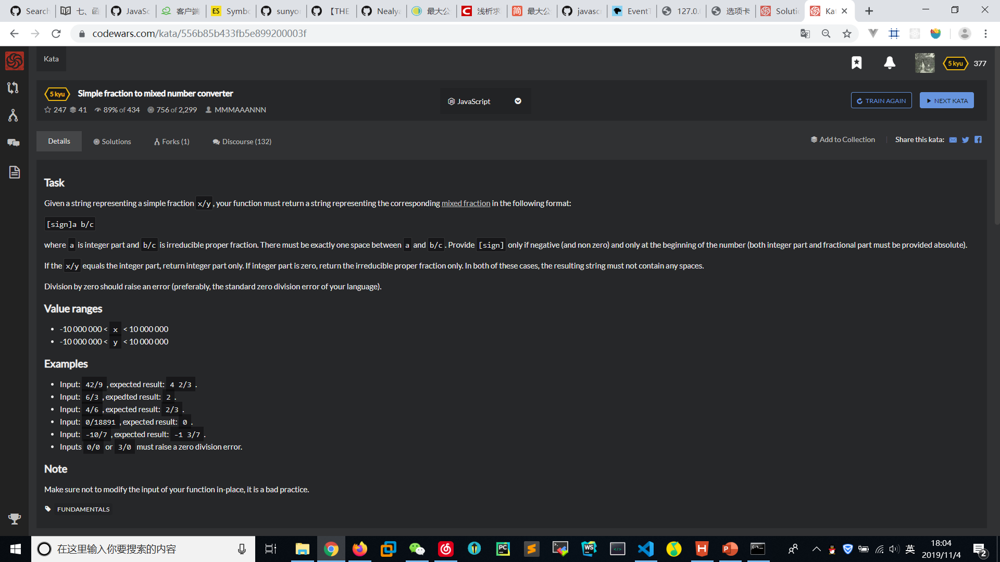

# Simple-fraction-to-mixed-number-converter
  

```
gcd = (a,b)=> b==0 ? a : gcd(b,a%b);

function mixedFraction(s){
    var [x,y] = s.plit("/").map(z=>+z);
    if(y==0) throw "ZeroDivisionError";
    if(x%y == 0)return ""+x/y;
    var g = gcd(x,y),add=x/y<0 ? "-" : "";
    x = Math.abs(x/g),y=Math.abs(y/g);
    return add+(x<y ? "" : Math.floor(x/y)+" ")+x%y+"/"+y;
}
```
+z相当于Number(z);