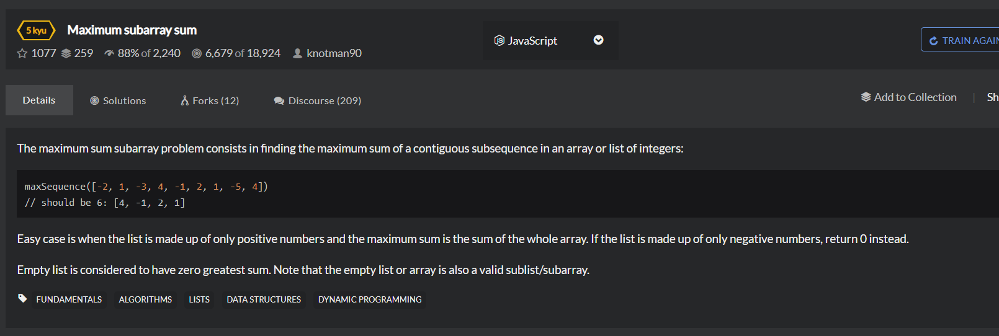

# Maximum-subarray-sum
  

## 循环暴力破解
```
var maxSequence = function(arr){
    // ...
    if(arr.length == 0){
        return 0;
    }

    for(let i=0;i<arr.length;i++){
        if(arr[i]>0){
            break;
        }
        if(i == arr.length-1 && arr[i]<0){
            return 0;
        }
    }

    let maxtemp = 0;
    for(let i=0;i<arr.length;i++){
        if(arr[i]>0){
            let temp = 0;
            for(let j=i;j<arr.length;j++){
                temp += arr[j];
                if(temp > maxtemp){
                    maxtemp = temp;
                }
            }
            
        }
    }

    console.log(maxtemp);
    return maxtemp;
}
```

## 较优解
```
var maxSequence = function(arr){
    var min = 0,ans=0,i,sum=0;
    for(i=0;i<arr.length;++i){
        sum += arr[i];
        min = Math.min(sum,min);
        ans = Math.max(ans,sum-min);
    }
    return ans;
}
```