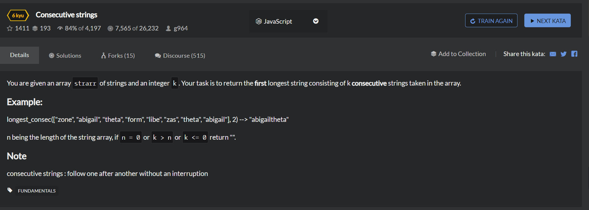

# Consecutive strings
  

```
function longestConser(strarr,k){
    if(strarr.length === 0 || k<1 || k>strarr.length){
        return "";
    }

    let result = "";
    let longestLength = 0;
    let longest = "";

    for(let i=0;i<strarr.length;i++){
        result = "";

        for(j=i;j<i+k;j++){
            if(strarr[j]!==undefined){
                result +=strarr[j];
            }
        }

        if(result.length > longestLength){
            longest = result;
            longestLength = result.length;
        }
    }

    return longest;
}
```

```
function longestConser(strarr,k){
    var longest = "";
    for(var i=0;k>0 && i<=strarr.length-k;i++){
        var tempArray = strarr.slice(i,i+k);
        var tempStr = tempArray.join("");
        if(tempStr.length>longest.length){
            longest = tempStr;
        }
    }
    return longest;
}
```