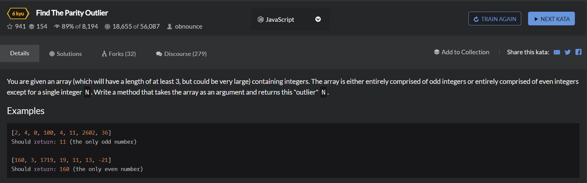

# Find The Parity Outlier

```
function findOutlier(integers){
  //your code here
  let temp = [];
  for(let i=0;i<3;i++){
      if(integers[i]%2 === 0){
          temp.push(integers[i]);
      }
  }
  
  if(temp.length>1){
      for(let i=0;i<integers.length;i++){
          if(integers[i]%2 != 0){
              return integers[i];
          }
      }
  }else{
    for(let i=0;i<integers.length;i++){
          if(integers[i]%2 == 0){
              return integers[i];
          }
      }
  }
}
```

```
function findOutliner(int){
    var even = int.filter(a=>a%2==0);
    var odd = int.filter(a=>a%2!==0);
    return even.length==1 ? even[0] : odd[0];
}
```