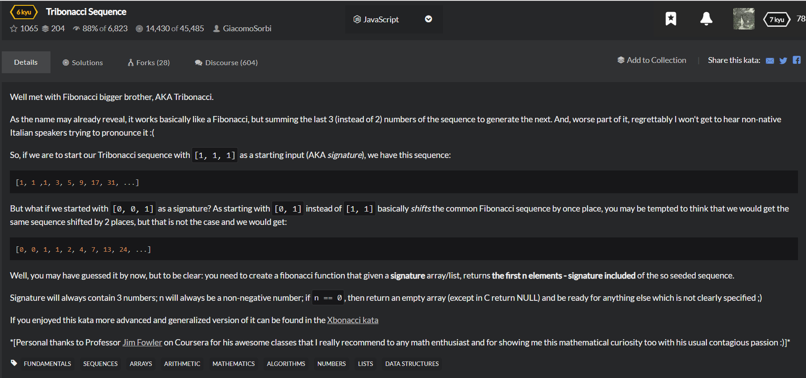

# Tribonacci Sequence
  

```
function tribonacci(signature,n){
  //your code here
  if(n===null){
      return [];
  }
  if(n<=3){
      let temp = [];
      for(let i=0;i<n;i++){
          temp.push(signature[i]);
      }
      return temp;
  }else{
      let temp = [];
      for(let i=0;i<3;i++){
          temp.push(signature[i]);
      }
     for(let i=3;i<n;i++){
          temp[i] = temp[i-1]+temp[i-2]+temp[i-3];
      }
      return temp;
  }
}
  
```

```
function tribonacci(signature,n){
    for(var i = 0;i<n-3;i++){
        sigunature.push(sigunature[i]+sigunature[i+1]+sigunature[i+2]);
    }
    return sigunature.slice(0,n);
}
```