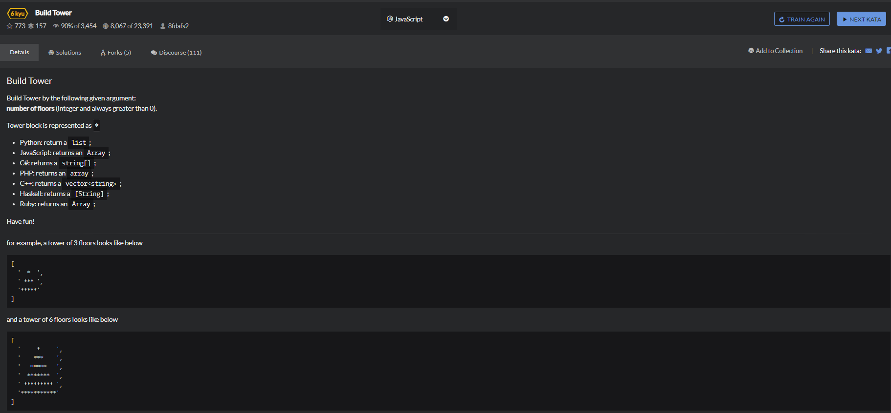

# Build-Tower

```
function towerBuilder(nFloors) {
  // build here
  if(nFloors<=0){
      return null;
  }
  
  let temp = [];
  let result = [];
  
  for(let i=0;i<nFloors;i++){
      for(let j=0;j<i*2+1;j++){
          temp.push('*');
      }
      result.push(temp.join(''));
      temp = [];
  }
  
  let lastlength = result[result.length-1].length;
  for(let i=0;i<result.length-1;i++){
      let before = [],after=[];
      for(let j=0;j<(lastlength-result[i].length)/2;j++){
          before.push(' ');
          after.push(' ');
      }
      result[i] = before.join('')+result[i]+after.join('');
      before = [];
      after=[];
  }
  
  return result; 
}
```
```
function towerBuilder(n){
    return Array.from({length:n},function(v,k){
        const spaces = ' '.repeat(n-k-1);
        return spaces + '*'.repeat(k+k+1)+spaces;
    });
}
```
repeat()构造并返回一个新的字符串，该字符串包含被连接在一起的指定数量的字符串的副本。  
Array.from()方法从一个类似数组或可迭代对象创建一个新的，浅拷贝的数组实例  
```
console.log(Array.from('foo'));
//["f","o","o"]
console.log(Array.from([1,2,3],x=>x+x));
//[2,4,6]
```
Array.from方法还支持类似数组的对象。所谓类似数组的对象，本质特征只有一点，即必须有length属性。因此，任何有length属性的对象，都可以通过Array.from方法转为数组，而此时扩展运算符就无法转换。
```
Array.from({length:3});
//[ undefined, undefined, undefined ]
```
```
Array.from({length:2},()=>'jack');
//['jack','jack']
```
Array.from的第一个参数指定了第二个参数运行的次数。  

v是当前元素的值，k是元素的索引。

{length：5}创建一个没有任何值但长度等于5的对象；

（v，k）=> k是一个箭头函数，用于将当前元素的索引号分配给该元素值。

```
function towerBuilder(n){
    return [...Array(n)].map((_,i)=>" ".repeat(n-1-i)+"*".repeat(i*2+1)+" ".repeat(n-1-i));
}
```