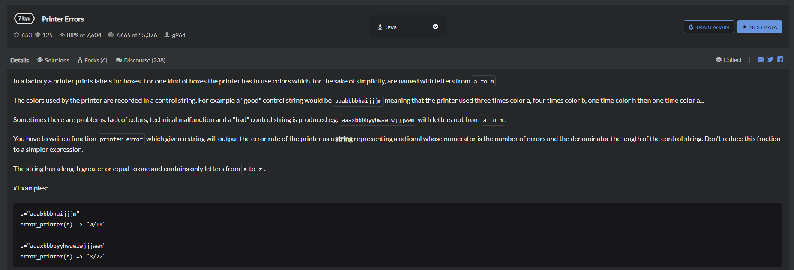

# 1.Printer Errors
  

```
public class Printer {
    
    public static String printerError(String s) {
        // your code
      String[] nowS = s.split("");
      int res = 0;
      
      for(int i=0;i<nowS.length;i++) {
        String now = nowS[i];
        int who = now.compareTo("m");
        
        if(who > 0) {
          res++;
        }
      }
      
      return res + "/" + nowS.length;
    }
}
```

```
public class Printer {
    public static String printerError (String s) {
        return s.replaceAll("[a-m]", "").length() + "/" + s.length();
    }
}
```