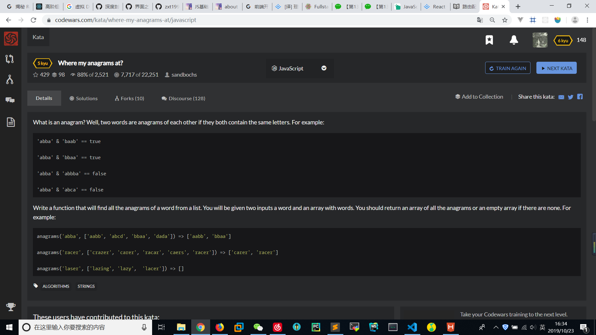

# Where my anagrams at
  

```
function anagrams(word, words) {
    let temp = word.split('').sort();
    let result = [];
    let tempwords = [];
    for(let i=0;i<words.length;i++){
        tempwords = words[i].split('').sort();
        if(tempwords.length === temp.length){
            result.push(words[i]);
            for(let j=0;j<temp.length;j++){
                if(tempwords[j]!=temp[j]){
                    result.pop(words[i]);
                    break;
                }
            }
        }
    }
    return result;
}
```

```
String.prototype.sort = function(){
    return this.split("").sort().join("");
};

function anagrams(word,words){
    return words.filter(function(x){
        return x.sort() === word.sort();
    });
}
```