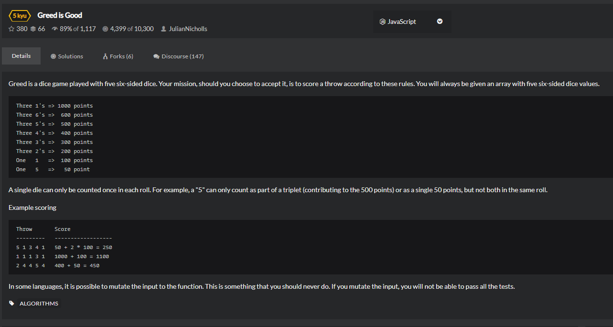

# Greed-is-Good
  

```
function score( dice ) {
    // Fill me in!
    let a = [];
    a.length = 7;
    let temp = {
        '1':1000,
        '6':600,
        '5':500,
        '4':400,
        '3':300,
        '2':200
    }
    for(let i=0;i<a.length;i++){
        a[i] = 0;
    }
    for(let i=0;i<dice.length;i++){
        for(let j=0;j<a.length;j++){
            if(dice[i]===j){
                a[j] += 1;
            }
        }
    }

    let result = 0;
    for(let i=1;i<a.length;i++){
        if(a[i]>=3){
            result += temp[i.toString()];
            a[i] -= 3;
        }
        if(a[i]>=1){
            if(i===1){
                result += 100*a[i];
            }else if(i===5){
                result += 50*a[i];
            }
        }
    }

    if(result === 0){
        return 0;
      }else{
          return result;
      }
  }
```
```
function score(dice){
    var dc = [0,0,0,0,0,0];
    var tdr = [1000,200,300,400,500,600];
    var sdr = [100,0,0,0,50,0];
    dice.forEach(function(x){
        dc[x-1]++;
    })
    return dc.reduce(function(s,x,i){
        return s + (x >= 3 ? tdr[i] : 0) + sdr[i]*(x % 3);
    },0);
}
```