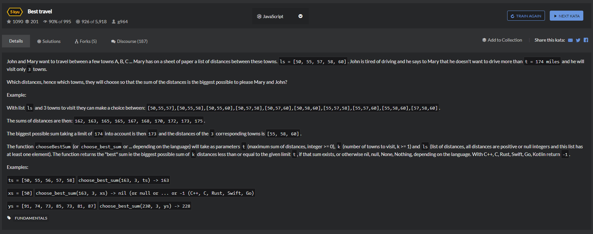

# Best-travel
   


1. 第一版，未优化，执行通过但会超时
```
function chooseBestSum(t, k, ls) {
    // your code
    if(ls.length<k){
        return null;
    }

    if(k===1){
        
        let minone = 9999;
        for(let i=0;i<ls.length;i++){
            if((t-ls[i])<minone && (t-ls[i])>=0){
                minone = ls[i];
            }
        }
        if(minone != 9999){
            return minone;
        }
    }
   let temppos = [];
   let tempArr = [];
 
   while(k-->0){
       if(tempArr.length === 0){
            for(let i=0;i<ls.length;i++){
                tempArr.push(t-ls[i]);
                temppos.push(i);
            }
            // console.log(temppos);
       }else if(!Array.isArray(tempArr[0])){
            let forsun = [],possun = [];
            for(let j=0;j<tempArr.length;j++){
                for(let i=0;i<ls.length;i++){
                    if(j!=i){
                        forsun.push(tempArr[j]-ls[i]);
                        possun.push(i);
                    }                    
                }
                tempArr[j] = forsun;
                temppos[j] = possun;
                forsun = [];
                possun = [];
            }
            // console.log(tempArr);
            // console.log(temppos);
        }
        else{
            let forsun = [],
            possun = [];
            for(let j=0;j<tempArr.length;j++){
                for(let i=0;i<tempArr[j].length;i++){
                    let everysun = [];
                    let everypos = [];
                    for(let e=0;e<temppos[j].length;e++){
                        if(e!=i){
                            everysun.push(tempArr[j][i]-ls[temppos[j][e]]);
                            everypos.push(temppos[j][e]);
                        }                    
                    }
                    possun.push(everypos);
                    everypos = [];
                    forsun.push(everysun);
                    everysun = [];
                }
            }
            temppos = possun;
            tempArr = forsun;
            // console.log(temppos);
            // console.log(tempArr);
        } 
   }

//    console.log(tempArr);
   let onlyres = 99999;
   for(let i=0;i<tempArr.length;i++){
       for(let j=0;j<tempArr[i].length;j++){
           if(tempArr[i][j] === 0){
               return t;
           }
           if(tempArr[i][j]<onlyres && tempArr[i][j] > 0){
               onlyres = tempArr[i][j];
           }
       }
   }
   if(onlyres != 99999){
       return t - onlyres;
   }else{
       return null;
   }
   
}

chooseBestSum(331,1,[ 91, 74, 73, 85, 73, 81, 87 ]);
```

2. 第二版，减少最终遍历的次数，顺利执行

```
function chooseBestSum(t, k, ls) {
    // your code
    console.log(t, k, ls);
    if(ls.length<k){
        return null;
    }

    if(k===1){
        
        let minone = 9999;
        let minones = [];
        for(let i=0;i<ls.length;i++){
            if(t-ls[i]>=0){
                minones.push(ls[i]);
            }
        }
        
        minones.sort(function(a,b){
            return a-b;
        })

//         console.log(minones);

//         console.log(minones[minones.length-1]);
        return minones[minones.length-1];
    }
   let temppos = [];
   let tempArr = [];
 
   while(k-->0){
       if(tempArr.length === 0){
            for(let i=0;i<ls.length;i++){
                tempArr.push(t-ls[i]);
                temppos.push(i);
            }
            // console.log(temppos);
       }else if(!Array.isArray(tempArr[0])){
            let forsun = [],possun = [];
            for(let j=0;j<tempArr.length;j++){
                for(let i=0;i<ls.length;i++){
                    if(j!=i){
                        forsun.push(tempArr[j]-ls[i]);
                        possun.push(i);
                    }                    
                }
                tempArr[j] = forsun;
                temppos[j] = possun;
                forsun = [];
                possun = [];
            }
            // console.log(tempArr);
            // console.log(temppos);
        }
        else{
            let forsun = [],
            possun = [];
            for(let j=0;j<tempArr.length;j++){
                for(let i=0;i<tempArr[j].length;i++){
                    let everysun = [];
                    let everypos = [];
                    for(let e=i+1;e<temppos[j].length;e++){
                        everysun.push(tempArr[j][i]-ls[temppos[j][e]]);
                        everypos.push(temppos[j][e]);                   
                    }
                    possun.push(everypos);
                    everypos = [];
                    forsun.push(everysun);
                    everysun = [];
                }
            }
            temppos = possun;
            tempArr = forsun;
            // console.log(temppos);
            // console.log(tempArr);
        } 
   }

//    console.log(tempArr);
   let onlyres = 99999;
   for(let i=0;i<tempArr.length;i++){
       for(let j=0;j<tempArr[i].length;j++){
           if(tempArr[i][j] === 0){
               return t;
           }
           if(tempArr[i][j]<onlyres && tempArr[i][j] > 0){
               onlyres = tempArr[i][j];
           }
       }
   }
   if(onlyres != 99999){
       return t - onlyres;
   }else{
       return null;
   }
   
}
```

3. 网站提交的较好的答案  

```
function chooseBestSum(t,k,ls){
    var biggestCount = 0;
    var recurseTowns = function(townsSoFar,lastIndex){
        townsSoFar = townsSoFar || [];
        if(townsSoFar.length === k){
            var sumDistance = townsSoFar.reduce((a,b)=>a+b);
            if(sumDistance <= t && sumDistance > biggestCount){
                biggestCount = sumDistance;
            }
            return;
        }
        for(var i=lastIndex + 1 || 0;i<ls.length;i++){
            resurseTowns(townsSoFar.concat(ls[i]),i);
        }
    }
    recurseTowns();

    return biggestCount || null;
}
```