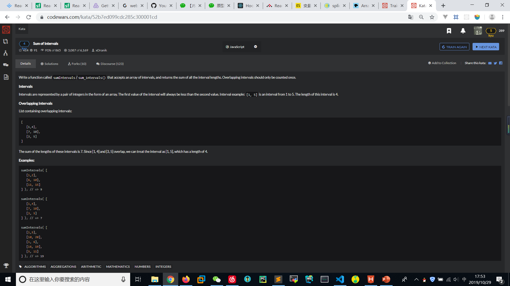
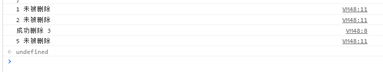

# Sum of Intervals
  

1. 自己完成的
```
function sumIntervals(intervals){
    //TODO
    for(let i=0;i<intervals.length-1;i++){
        let fori = 0;
        for(let j=i+1;j<intervals.length;j++){
            if((intervals[j][0]-intervals[i][0]>=0  && intervals[i][1]-intervals[j][1] >= 0) || 
            (intervals[i][0]==intervals[j][0] && intervals[i][1]==intervals[j][1])){
                intervals.splice(j,1);
                j = j - 1;
            }else if(intervals[j][0]-intervals[i][0]<=0  && intervals[i][1]-intervals[j][1] <= 0){
                intervals.splice(i,1);
                fori += 1;
                break;
            }
            else if(intervals[i][1] > intervals[j][0] && intervals[i][1] < intervals[j][1]){
                intervals[i][1] = intervals[j][1];
                intervals.splice(j,1);
                j = j - 1;
            }else{
                continue;
            }
        }
        if(fori>0){
            i = i-1;
        }
    }

    let result = 0;
    for(let i=0;i<intervals.length;i++){
        result += (intervals[i][1]-intervals[i][0]);
    }

    console.log(intervals);
    console.log(result);
    return result;
  }

  var test1 = [ [ 144, 431 ],
  [ -45, 288 ],
  [ 9, 34 ],
  [ -3, 266 ],
  [ -59, 133 ],
  [ -316, -307 ],
  [ 384, 453 ],
  [ -314, 57 ],
  [ -97, -61 ],
  [ -396, -6 ],
  [ -37, 19 ],
  [ -409, 453 ],
  [ -122, 301 ] ];
  sumIntervals(test1);
```

2. 较优解

```
function sumIntervals(intervals){
    var numbers = [];
    intervals.forEach(function (interval){
        for(var i=interval[0];i<interval[1];i++){
            if(numbers.indexOf(i)==-1)numbers.push(i);
        }
    });
    return numbers.length;
}
```

## 遇到的关于splice的坑
```

var arr = new Array(1, 2, 3, 4, 5);     //初始化数字集合
var delete_number = 3;    //要被删除的数字
 
//遍历数组
for(var i=0; i<arr.length; i++){
    if(arr[i] === delete_number){   //如果找到要被删除的数字所在的数组下标
        var num = arr.splice( i, 1 );   //从i位置开始删除1个数字
        console.log("成功删除 "+num);    //输出被删除的数字
    }
    else{
        console.log(arr[i]+" 未被删除");    //如果i下标的数组元素不是需要被删除的数字，就输出数字
    }
}
```
  

splice 是直接操作并修改数组的，所以当找到数字3时在循环中的 i 下标是2，而当删除数字3后，数组下标 i 位置中保存的数字变为了数字4，然后到了下一个循环 i 下标为3时，数组下标 i 位置中保存的数字是5，所以跳过了数字4，于是调试信息中没有可爱的数字4.。。。原理就是这样子，是不是很绕。  

```
if(arr[i] === delete_number){   //如果找到要被删除的数字所在的数组下标
    var num = arr.splice( i, 1 );   //从i位置开始删除1个数字
    console.log("成功删除 "+num);    //输出被删除的数字
    
    i = i-1;    //解决方案
}

```