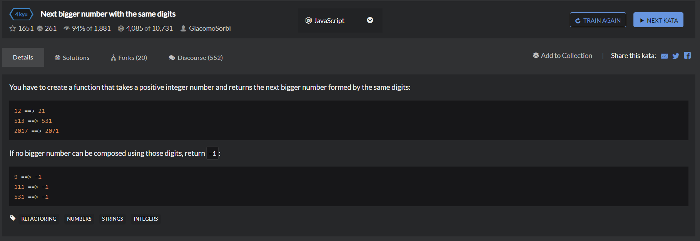

# Next bigger number with the same digits
  

实在搞不定的一题
```
const sortedDigits = n => {
    let arr = n.toString().split('');
    arr.sort((a,b)=> b-a);
    return arr;
};

function nextBigger(n){
    let arr = sortedDigits(n);
    let max = parseInt(arr.join(''),10);

    for(var i=n+1;i<=max;i++){
        if(sortedDigits(i).every((x,j)=>x===arr[j])){
            return i;
        }
    }

    return -1;
}
```

```

```