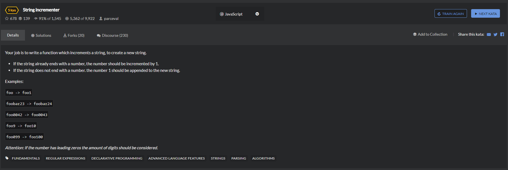

# 20.String-incrementer
  

## 暴力解法
```
function incrementString (strng) {
    // return incrementedString
    let tempArray = strng.split('');
    let tempAs = tempArray.slice(0)
    let rege = /[0-9]/;
    let renum = [];
    for(let i = tempArray.length-1;i>=0;i--){
        if(rege.test(parseInt(tempArray[i]))){
            renum.push(tempArray[i]);
        }else{
            break;
        }
    }

    if(renum != []){
        tempArray.splice(-(renum.length));
    }

    renum = renum.reverse();
    let renumlen = renum.length;
    let zero = 0;
    for(let i=0;i<renum.length;i++){
        if(renum[i] ==='0'){
            zero += 1;
        }else{
            break;
        }
    }
    console.log(zero);

    if(renum.length == 0){
        tempAs.push('1');
//         console.log(tempAs.join(''));
        return tempAs.join('');
    }else{
//         console.log(parseInt(renum.join('')));
        if(zero == 0){
            console.log((parseInt(renum.join(''))+1).toString().split(''));
            (parseInt(renum.join(''))+1).toString().split('').forEach(function(ele){
                console.log(ele);
                tempArray.push(ele);
            })
//             console.log(tempArray.join(''));
            return tempArray.join('');
        }else{
            renum.splice(0,zero);
            console.log(renum);
            if(renum.length == 0){
                for(let e=0;e<zero-1;e++){
                    tempArray.push('0');
                }
                tempArray.push('1');
                return tempArray.join('');
            }
            let numres = (parseInt(renum.join(''))+1).toString().split('');
            console.log(numres);
            if(numres.length > renumlen){
                numres.forEach(function(ele){
                    tempArray.push(ele);
                })
                return tempArray.join(''); 
            }else{
                let len = renumlen - numres.length;
                for(let j=0;j<len;j++){
                    tempArray.push('0');
                }
                numres.forEach(function(ele){
                    tempArray.push(ele);
                })
                return tempArray.join('');
            }
        }
    }

}
```
## 较优解一
```
function incrementString(input){
    if(isNaN(parseInt(input[input.length-1]))) return input+'1';
    return input.replace(/(0*)([0-9]+$)/,function(match,p1,p2){
        var up = parseInt(p2) + 1;
        return up.toString().length > p2.length ? p1.slice(0,-1) + up : p1 + up;
    });
}
```

```
const s = 'abcdefg'
console.log(s.slice(0, -1 + s.length))
// abcdef
console.log(s.slice(0, -1))
// abcdef
```

## 较优解二
```
function incrementString(input){
    return input.replcae(/([0-8]?)(9*)$/,function(s,d,ns){
        return +d + 1 + ns.replace(/9/g,'0');
    });
}
```

## 较优解
```
let incrementString = str => str.replace(/([0-8]|\d?9+)?$/,(e)=>e ? +e+1 : 1)
```