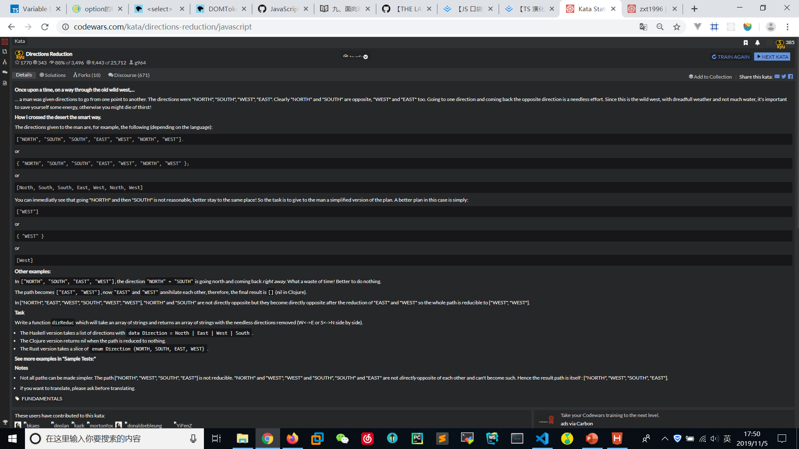

# Directions-Reduction
  

```
function dirReduc(arr){
    // ...
    let temp = {
        "NORTH":"SOUTH",
        "SOUTH":"NORTH",
        "WEST":"EAST",
        "EAST":"WEST"
    };

    for(let i=arr.length-1;i>0;i--){
        if(arr[i-1]==temp[arr[i]]){
            arr.splice(i-1,2);
        }
    }
    return arr;
    console.log(arr);
}
```

```
function dirReduc(arr){
    var str = arr.join(''),pattern=/NORTHSOUTH|EASTWEST|SOUTHNORTH|WESTEAST/;
    while(pattern.test(str)){
        str = str.replace(pattern,'');
    }
    return str.match(/(NORTH|SOUTH|EAST|WEST)/g) || [];
}
```
