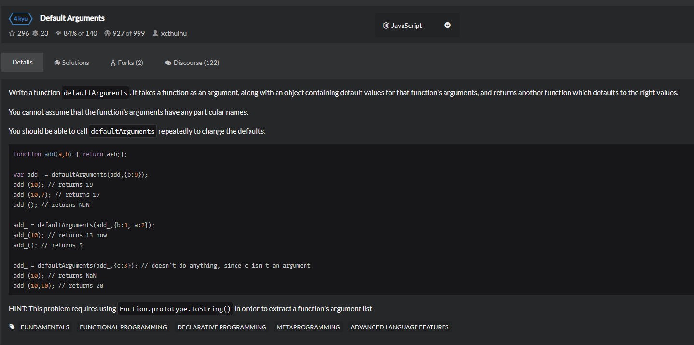

# Default-Arguments
  

## 又一搞不定系列
```
function defaultArguments(func,params){
    var names = func.names || func.toString().replace(/\/\/.*$|\/\*.*?\*\/|\s/gm, '')
    .match(/(?:[\w]+(?:,[\w]+)*)?(?=\))/m)[0].split(',');

    var detocur = function (){
        var input = arguments;
        return func.apply(this,names.map(function(val,i){
            return i<input.length ? input[i] : params[names[i]];
        }));
    };

    detour.names = names;
    return detour;
}
```

```
Function.prototype.getParamNames = function(){
    var fnStr = this.toString().replace(/((\/\/.*$)|(\/\*[\s\S]*?\*\/))/mg, '');
    return fnStr.slice(fnStr.indexOf('(')+1, fnStr.indexOf(')')).match(/([^\s,]+)/g) || [];
}

function defaultArguments(func,params){
    if(!params)return func;
    var paramNames = func.getParamNames();
    var f = function(){
        var args = [].slice.call(arguments);
        return func.apply(null,args.concat(paramNames.map(function(p){
            return params[p];
        }).slice(args.length)));
    };
    f.getParamNames = function(){
        return paramNames;
    };
    return f;
}
```

```
function defaultArguments(f,params){
    const defaults = f.toString().match(/\(([^)]*)\)/)[1].split(',').map(name => params[name.replace(/\/\*[\s\S]*?\*\/|([^:]|^)\/\/.*$/gm, '').trim()])

    const res = (...args) => f(...args,...defaults.slice(args.length));
    res.toString = () => f.toString()
    return res
}
```