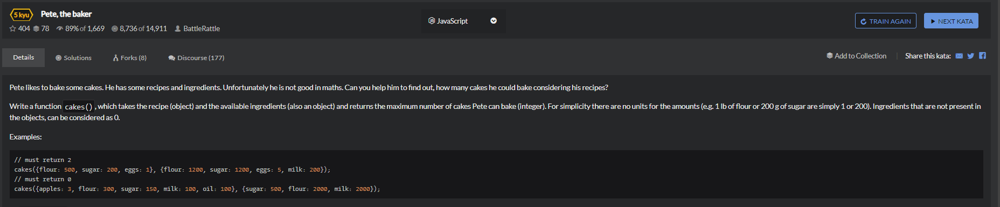

# Pete,the baker

```
function cakes(recipe, available) {
  // TODO: insert code
  let a = Array.from(Object.keys(recipe));
  let b = Array.from(Object.keys(available));

  if(a.length > b.length){
      return 0;
  }

  let posi = [];
  let temp = [];
  
  for(let i=0;i<a.length;i++){
      let tempa = b.indexOf(a[i]);
      posi.push(tempa);
      temp.push(recipe[a[i]]);
  }

  if(posi.length != a.length){
      return 0;
  }

  for(let i=0;i<a.length;i++){
    temp[i] = Math.floor(available[a[i]]/temp[i]);
  }

  temp.sort((a,b)=>a-b);

  return temp[0];
}
```

```
function cakes(recipe,available){
    return Object.keys(recipe).reduce(function(val,ingredient){
        return Math.min(Math.floor(available[ingredient]/recipe[ingredient] || 0),val)
    },Infinity)
}
```