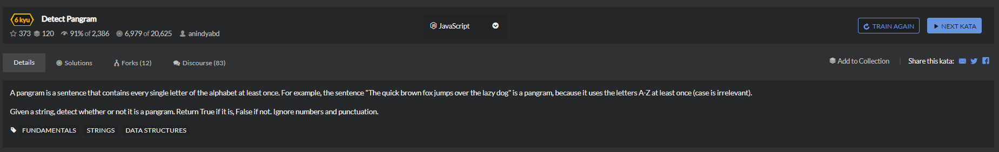

# Detect Pangram

```
function isPangram(string){
  //...
  string = string.toUpperCase();
  let temp = [];
  for(let i=0;i<26;i++){
      temp.push(String.fromCharCode(65+i));
  }
  let othertemp = string.split(' ');
  let retemp = [];
  for(let i=0;i<othertemp.length;i++){
    var forarray = othertemp[i].split('');
    for(let j=0;j<forarray.length;j++){
      retemp.push(forarray[j]);
    }
  }

  console.log(retemp)
  console.log(temp);
  let num = 0;
  for(let i=0;i<temp.length;i++){
    if(retemp.indexOf(temp[i])>=0){
      ++num;
    }   
  }

  if(num===26){
    return true;
  }else{
    return false;
  }
}
```
```
function isPangram(string){
    string = string.toLowerCase();
    return "abcdefghijklmnopqrstuvwxyz".split("").every(function(x){
        return string.indexOf(x) !== -1;
    })
}
```
every() 方法测试一个数组内的所有元素是否都能通过某个指定函数的测试。它返回一个布尔值。
```
function isPangram(string){
    return (string.match(/([a-z])(?!.*\1)/ig) || []).length === 26;
}
```