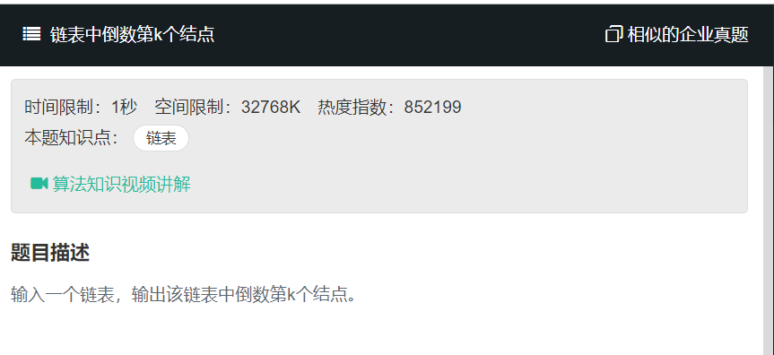

# 链表中倒数第k个节点
  

```
/*function ListNode(x){
    this.val = x;
    this.next = null;
}*/
function FindKthToTail(head, k)
{
    // write code here
    if(!head){
        return
    }
    let temp = [];
    while(head){
        temp.push(head);
        if(head.next == null){
             break;
        }
        head = head.next;
    }
    return temp[temp.length-k];
    
}
```
 用两个指针来跑，两个指针中间相距k-1个节点,第一个指针先跑，跑到了第k个节点时，第二个指针则是第一个节点。

这时候两个一起跑。当第一个跑到了最后一个节点时，这时候第一个指针则是倒数第k个节点。
```
function FindKthToTail(head, k)
{
    // write code here
  if (head === null || k <= 0) return null;
  let pNode1 = head,
    pNode2 = head;
  while (--k) {
    if (pNode2.next !== null) {
      pNode2 = pNode2.next;
    } else {
      return null;
    }
  }
  while (pNode2.next !== null) {
    pNode1 = pNode1.next;
    pNode2 = pNode2.next;
  }
  return pNode1;
    
}
```