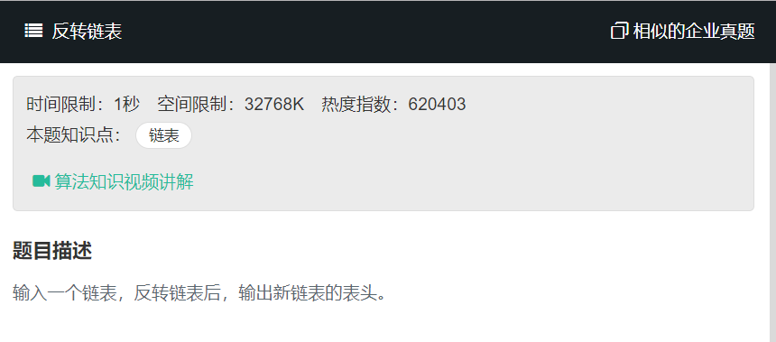
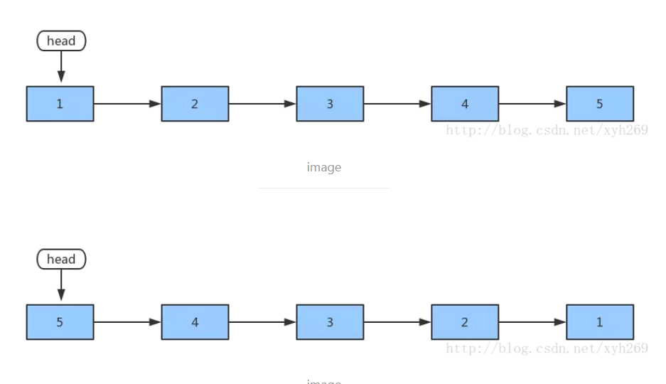

# 反转链表
  

```
/*function ListNode(x){
    this.val = x;
    this.next = null;
}*/
function ReverseList(pHead)
{
    // write code here
   let pNext = null;
    let pre = null;
    while(pHead){
        pNext = pHead.next;
        pHead.next = pre;
        pre = pHead;
        pHead = pNext;
    }
    return pre;
}
```

  

1. next=head.next;  
   将head.next赋值给变量，也就是说next指向了节点2，先将节点2保存起来  
2. head.next = pre;  
   将pre变量赋值给了head.next,即节点1指向了null.  

3. pre = head;  
   将head赋值给了pre,即pre指向节点1,将节点1设为"上一个节点"  

4. head = next;  
   将next赋值给head,即head指向了节点2.将节点2设置为“头节点”