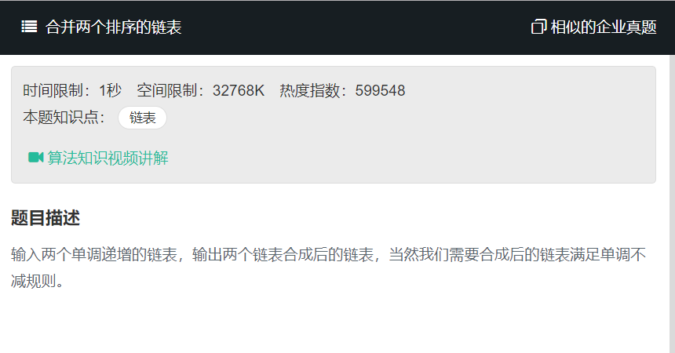
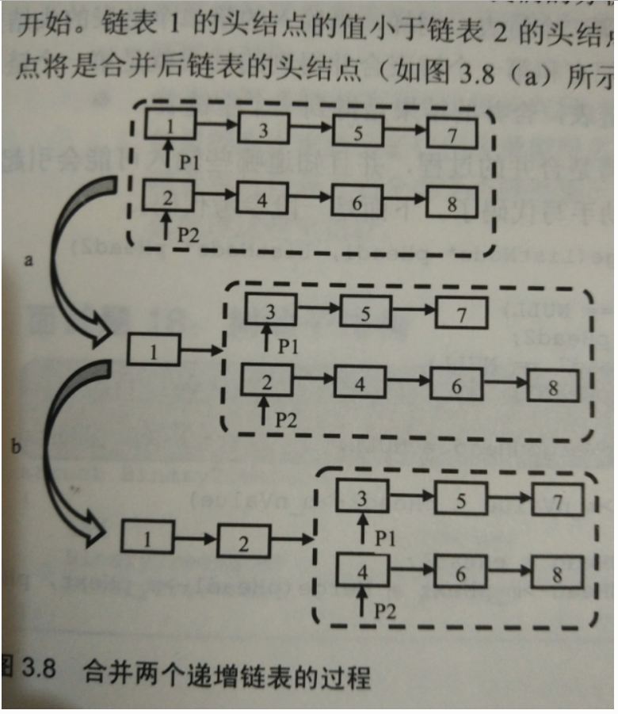

# 合并两个排序的链表

  
  

  

1. 递归
```
/*function ListNode(x){
    this.val = x;
    this.next = null;
}*/
function Merge(pHead1, pHead2)
{
    // write code here
    let tempHead = null;
    if(pHead1 == null){
        return pHead2;
    }
    if(pHead2 == null){
        return pHead1;
    }
    if(pHead1.val<pHead2.val){
        tempHead = pHead1;
        tempHead.next = Merge(pHead1.next,pHead2);
    }else{
        tempHead = pHead2;
        tempHead.next = Merge(pHead1,pHead2.next);
    }
    
    return tempHead;
    
}
```

2. 非递归做法
```
/*function ListNode(x){
    this.val = x;
    this.next = null;
}*/
function Merge(pHead1, pHead2)
{
    // write code here
     if(pHead1 == null){
        return pHead2;
    }
    if(pHead2 == null){
        return pHead1;
    }
    
    let temp= new ListNode(0);
    let temphead = temp;
    while(pHead1!=null && pHead2!=null){
        if(pHead1.val<pHead2.val){
            temp.next = pHead1;
            pHead1 = pHead1.next;
        }else{
            temp.next = pHead2;
            pHead2 = pHead2.next;
        }
        
        temp = temp.next;
       
    }
    if(pHead1!=null){
        temp.next = pHead1;
    }
    
    if(pHead2!=null){
        temp.next = pHead2;
    }
    
     return temphead.next;
    
}
```