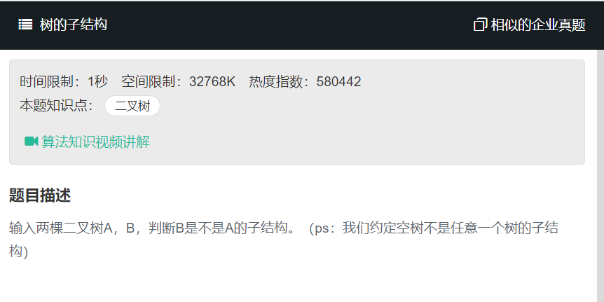

# 树的子结构
  

**树的求解一般和递归有关**  
要查找树A中是否存在和树B结构一样的子树，可以分成两步： 1.第一步在树A中找到和B的根节点的值一样的结点R； 这实际上就是树的遍历。可以用递归实现

递归调用HasSubTree遍历二叉树A。如果发现某一结点的值和树B的头结点的值相同，则转向第2步判断两个结点为根的数是否存在父子关系

2.第二步再判断树A中以R为根结点的子树是不是包含和树B一样的结构。 这个过程其实就是要要判断两棵树对应的节点数据是否相同。这个是一个递归的过程。  

```
/* function TreeNode(x) {
    this.val = x;
    this.left = null;
    this.right = null;
} */
function HasSubtree(pRoot1, pRoot2)
{
    // write code here
    if(pRoot2 == null){
        return false;
    }else if(pRoot1 == null){
        return false;
    }
    
    let result;
    //如果当前父树的节点与子树的根节点相同，则直接从父树的当前位置开始判定
    if(pRoot1.val == pRoot2.val){
        result = DoesParentHaveChild(pRoot1,pRoot2);
    }
    
    if(result != true){
        return HasSubtree(pRoot1.left,pRoot2)||HasSubtree(pRoot1.right,pRoot2);
    }else{
        return true;
    }
}

function DoesParentHaveChild(parent,child){
    if(child == null){
        //如果子树为null,那么必然是子树
        return true;
    }
    else if(parent == null){
        //子树不是null,父亲树是null
        return false;
    }
    
    //两个节点的值不相等，那么两个树必然不是父子关系
    if(parent.val != child.val){
        return false;
    }else{
        //否则当前节点当前相等，则递归的判断左子树和右子树对应节点是否相等
        return DoesParentHaveChild(parent.left,child.left)&&DoesParentHaveChild(parent.right,child.right);
    }
}
```