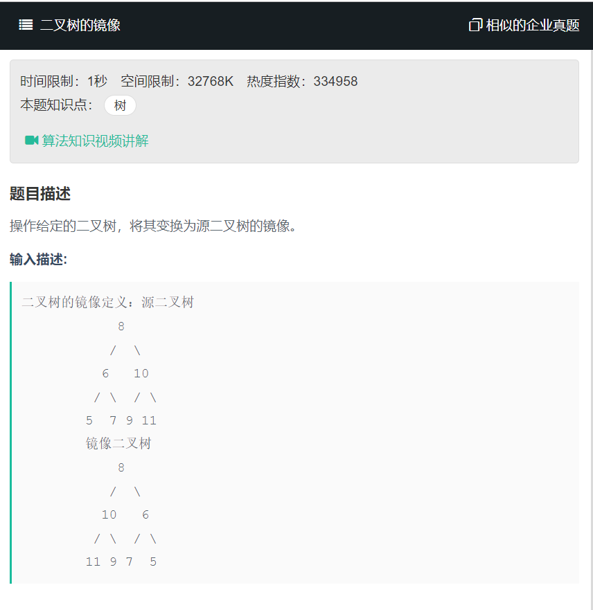

# 二叉树的镜像
  


1. 递归
```
/* function TreeNode(x) {
    this.val = x;
    this.left = null;
    this.right = null;
} */
function Mirror(root)
{
    // write code here
    if(root == null){
        return;
    }
    [root.right,root.left] = [root.left,root.right];
    Mirror(root.right);
    Mirror(root.left);
}
```