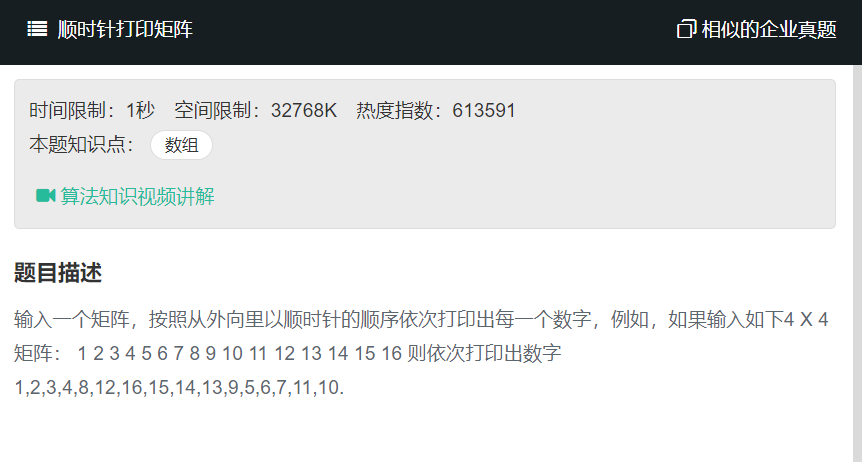

# 顺时针打印矩阵
  
  

我们注意4X4的矩阵，只有两圈，到从第一圈到第二圈，起点从（0,0）变为了（1,1），我们发现4>1*2,类似的对于一个5X5的矩阵而言，最后一圈只有一个数字，起点坐标为（2,2），满足5>2*2,同理对于6X6的矩阵也是类似。故可以得出循环的条件就是columns>startX*2并且rows>startY*2。
```
function printMatrix(matrix)
{
    // write code here
    let matrixList = [];
    if(matrix == null || matrix.length == 0){
        return null;
    }
    
    let row = matrix.length;  //行
    let col = matrix[0].length;  //列
    let start = 0;
    
    //从内圈到外圈
    while(col>start*2 && row>start*2){
        let endX = col-start-1;
        let endY = row-start-1;
        //从左到右
        for(let i=start;i<=endX;i++){
            matrixList.push(matrix[start][i]);
        }
        if(start<endY){
            //从上到下
            for(let i=start+1;i<=endY;i++){
                matrixList.push(matrix[i][endX]);
            }
        }
        if(start<endX && start<endY){
            //从右到左
            for(let i=endX-1;i>=start;i--){
                matrixList.push(matrix[endY][i]);
            }
        }
        if(start <endX && start<endY-1){
            //从下到上
            for(let i=endY-1;i>=start+1;i--){
                matrixList.push(matrix[i][start]);
            }
        }
        start++;
    }
    return matrixList;
}
```