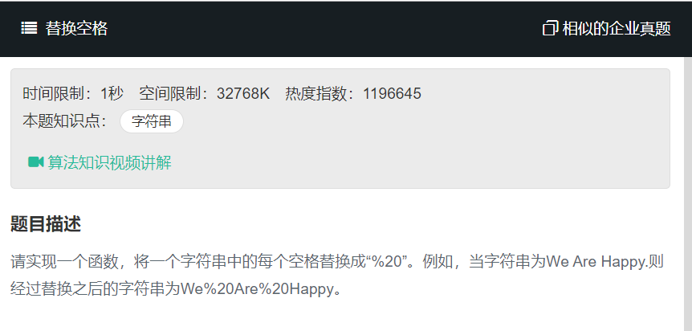

# 替换空格
  

```
function replaceSpace(str){
    return str.replace(/\s/g,'%20');
}

module.exports = {
    replaceSpace:replaceSpace
}
```
replace() 方法返回一个由替换值（replacement）替换一些或所有匹配的模式（pattern）后的新字符串。模式可以是一个字符串或者一个正则表达式，替换值可以是一个字符串或者一个每次匹配都要调用的回调函数。

**原字符串不会改变。**  

正则表达式：  
- \s  
  空格