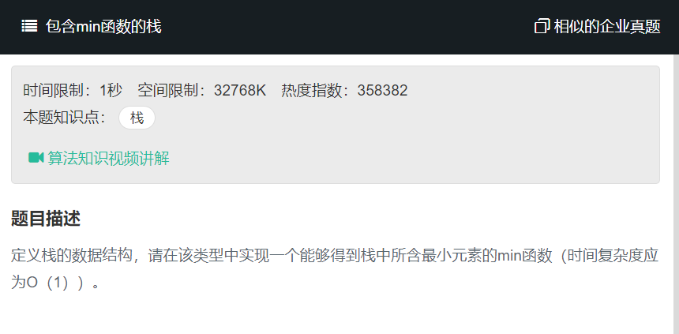

# 包含min函数的栈
  

```
let temp = [];
let tempmin = null;

function push(node)
{
    // write code here
    temp.push(node);
}
function pop()
{
    // write code here
    temp.pop();
}
function top()
{
    // write code here
    return temp[temp.length-1];
}
function min()
{
    // write code here
    tempmin = temp[0];
    for(let i=1;i<temp.length;i++){
        if(temp[i]<tempmin){
            tempmin=temp[i];
        }
    }
    return tempmin;
}
```

利用辅助栈
```
const stack = [],minStack=[];
let tmp = null;

function push(node)
{
    // write code here
    if(tmp!==null){
        if(tmp>node){
            tmp=node;
        }
        stack.push(node);
        minStack.push(tmp);
    }else{
        tmp = node;
        stack.push(node);
        minStack.push(tmp);
    }
}
function pop()
{
    // write code here
    stack.pop();
    minStack.pop();
}
function top()
{
    // write code here
    return stack[stack.length-1];
}
function min()
{
    // write code here
    return minStack[minStack.length-1];
}
```