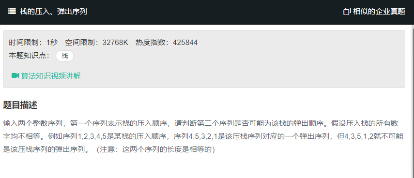

# 栈的压入、弹出序列
  
  

## 第一种方法
1. 我先取出pop序列的第一个（比如pop【3,2,4,5,1】），在push序列中找到这个位置，push【1,2,3,4,5】，

2. 此时我们找到了3的位置.那么下一个pop的数字（此时的数字是2）必然是，push中3的前一个数字，或者后面的数字。否则返回False 如此循环直到最后，判断长度相等，就是弹出序列。否则返回False.
```
function IsPopOrder(pushV, popV)
{
    // write code here
    if(pushV.length != popV.length){
        return false;
    }else if(pushV === null && popV === null){
        return false;
    }else if(pushV.length==1 && popV.length==1){
        if(pushV[0]!=popV[0]){
            return false;
        }else{
            return true;
        }
    }else{
        let temp = null;
        for(let i=popV.length-1;i>0;i--){
            temp = popV[i];
            for(let j=0;j<pushV.length;j++){
                if(popV[popV.length-1] == pushV[0]){
                    if(popV[popV.length-2]!= pushV[1]){
                        return false;
                    }
                }
                else if(temp == pushV[j]){
                    if(popV[i+1] != pushV[j+1] || popV[i+1] != pushV[j-1]){
                        return false;
                    }
                }
            }
        }
        return true;
    }
}
```