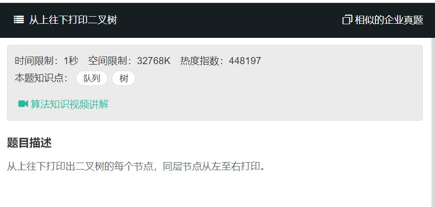

# 从上往下打印二叉树
    

```
/* function TreeNode(x) {
    this.val = x;
    this.left = null;
    this.right = null;
} */
function PrintFromTopToBottom(root)
{
    // write code here
    const queue = [],res = [];
    if(root === null){
        return res;
    }
    queue.push(root);
    while(queue.length){
        const pRoot = queue.shift();
        if(pRoot.left !== null){
            queue.push(pRoot.left);
        }
        if(pRoot.right !== null){
            queue.push(pRoot.right);
        }
        res.push(pRoot.val);
    }
    return res;
    
    
}
```
shift() 方法从数组中删除第一个元素，并返回该元素的值。此方法更改数组的长度。
