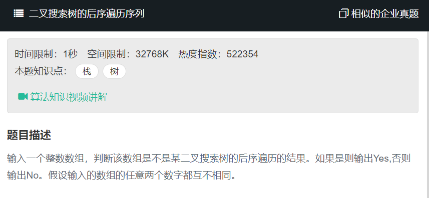

# 二叉搜索树的后序遍历序列
  
  

## 基础知识
二叉排序树或者是一棵空树，或者是具有下列性质的二叉树：

1. 若左子树不空，则左子树上所有结点的值均小于它的根结点的值；

2. 若右子树不空，则右子树上所有结点的值均大于或等于它的根结点的值；

3. 左、右子树也分别为二叉排序树；

4. 没有键值相等的节点。

**注意：左子树上所有结点的值均小于它的根结点的值**

对一棵二叉搜索树进行中序遍历（左根右）可得到一个关键字递增有序序列

## 题目分析
1. 后续遍历我们可以知道，最右边的是根节点r。

2. 通过根节点r我们可以判断左子树和右子树。

3. 判断左子树中的每个值是否小于r,右子树的每个值是否大于r.

4. 对左、右子树递归判断。
```
function VerifySquenceOfBST(sequence)
{
    // write code here
    if(sequence.length == 0){
        return false;
    }
    
    return judge(sequence,0,sequence.length-1);
}

function judge(sequence,left,right){
    if(left>=right){
        return true;
    }
    
    //后一半的元素都比根元素大
    let mid = right-1;
    while(sequence[mid]>sequence[right]){
        mid--;
    }
    
    //前面的元素都比根元素小
    let i=left;
    while(i<mid&&sequence[i]<sequence[right]){
        i++;
    }
    if(i<mid){
        return false;
    }
     
    return judge(sequence,left,mid)&&judge(sequence,mid+1,right-1);
}
```

```
function VerifySquenceOfBST(sequence)
{
    // write code here
    let n = sequence.length,i=0;
    if(!n)return false;
    while(n--){
        //循环结束时，i是第一个大于根元素的位置，即右子树首元素下标
        while(sequence[i]<sequence[n])i++;
        //循环结束时，i越过右子树末节点，到达根节点
        while(sequence[i]>sequence[n])i++;
        //如果没有到达根节点，说明不满足左子树所有节点小于根节点，右子树所有节点大于根节点的条件
        if(i<n)return false;
        i=0;
    }
    //如果循环一直到n==0才终止，说明以所有节点为根节点，左侧序列均满足后序列遍历序列的条件
    return true;
}
```