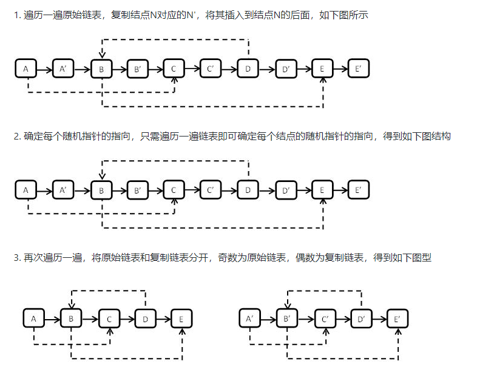

# 复杂链表的复制


## 暴力法
- 复制正常的链表指针域，从头开始遍历所有的结点即可
- 复制随机的指针域，由于指针的位置是一一对应的，查找原来的随机指针域在新链表中对应位置$(O(N))$,遍历一遍将所有的随机指针都复制则需要$(O(N^2))$

```
function RandomListNode(x){
    this.label = x;
    this.next = null;
    this.random = null;
}

//找到newHead指向的新链表中与原来链表oldHead的randNode节点对应的那个节点
//复制的链表newHead与原链表oldHead存在一一对应的关系
//因此使用两个指针(一个指向原来链表一个指向新链表)同步移动
//即可找到newHead指向的新链表中与原来链表oldHead的randNode节点对应的那个节点

function FindInNew(oldHead,newHead,randNode){
    let currNode = oldHead;
    let newNode = newHead;
    
    while(currNode != null && newHead!=null){
        if(randNode == currNode){
            return newNode;
        }
        currNode = currNode.next;
        newNode = newNode.next;
    }
    return null;
}

//复制操作
function Clone(pHead)
{
    // write code here
    if(pHead === null){
        return null;
    }
    let currNode = pHead;
    let newHead = null,preNode = null,newNode=null;
    //首先复制原链表的普通指针域，一次遍历即可完成
    while(currNode != null){
        //获取节点值
        newNode = new RandomListNode(currNode.label);
        //指向下个节点
        currNode = currNode.next;
        if(preNode === null){
            //获取表头
            newHead = newNode;
        }else{
            preNode.next = newNode;
        }
        preNode = newNode;
    }
    
    //接着复制随机指针域，需要两次遍历
    currNode = pHead;
    newNode = newHead;
    while(currNode != null && newNode != null){
        let randNode = currNode.random;
        let newRandNode = FindInNew(pHead,newHead,randNode);
        newNode.random = newRandNode;
        
        //链表同步移动
        currNode = currNode.next;
        newNode = newNode.next;
    }
    return newHead;
}
```

## 用map来存储新旧链表的节点对应关系(空间换取时间)

```
function RandomListNode(x){
    this.label = x;
    this.next = null;
    this.random = null;
}


function Clone(pHead) {
  // write code here
    if (pHead === null) {
        return null;
    }
    const nodeMap = new Map();
    let currNode = pHead;
    let newHead=null,preNode=null,newNode=null;
    
    //首次复制原链表的普通指针域，一次遍历即可完成
    while(currNode != null){
        newNode = new RandomListNode(currNode.label);
        //给map存入键和值
        nodeMap.set(currNode,newNode);
        currNode = currNode.next;
        
        if(preNode == null){
            newHead = newNode;
        }else{
            preNode.next = newNode;
        }
        preNode = newNode;
    }
    
    //接着复制随机指针域，需要两次遍历
    currNode = pHead;
    newNode = newHead;
    while(currNode!=null && newNode!=null){
        let randNode = currNode.random;
        let newRandNode = nodeMap.get(randNode);
        newNode.random = newRandNode;
        
        //链表同步移动
        currNode = currNode.next;
        newNode = newNode.next;
    }
    return newHead;
}
```

## 用next指针域关联新旧节点
  

```
function RandomListNode(x){
    this.label = x;
    this.next = null;
    this.random = null;
}


function Clone(pHead) {
  // write code here
    if (pHead === null) {
        return null;
    }
    let currNode = pHead;
    let newHead=null,preNode=null,newNode=null;
    //首先复制原链表的普通指针域，一次遍历即可完成
    //将新的节点链接到原来节点的末尾
    while(currNode!=null){
        if((newNode=new RandomListNode(currNode.label))==null){
            return null;
        }
        
        //将新的节点newNode连接在currNode的后面
        newNode.next = currNode.next;
        currNode.next = newNode;
        
        //指向下一个节点
        currNode = newNode.next;
    }
    
    //接着复制随机指针域
    //原来节点的下一个位置就是其对应的新节点
    currNode = pHead;
    newNode = pHead.next;
    while(currNode!=null){
        let randNode = currNode.random;
        let newNode = currNode.next;
        if(randNode != null){
            newNode.random = randNode.next;
        }else{
            newNode.random = null;
        }
        //链表同步移动
        currNode = newNode.next;
    }
    
    //将链接在一起的新旧两个链表拆分开
    //脱链，更新各链表的next指针
    currNode = pHead;
    newNode = newHead = pHead.next;
    while(currNode!=null){
        currNode.next = newNode.next;
        if(newNode.next != null){
            newNode.next = newNode.next.next;
        }else{
            newNode.next = null;
        }
        currNode = currNode.next;
        newNode = newNode.next;
    }
    return newHead;
   
}
```