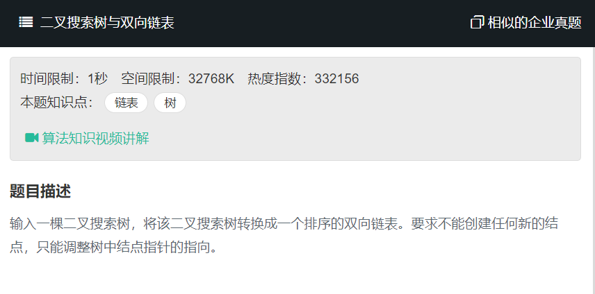

# 二叉搜索树与双向链表
  

二叉排序树的左节点的值 < 根结点的值 < 右子节点的值，其中序遍历就是一个排序好的信息串  

实现方法：  
- 中序遍历来实现二叉搜索树向双向链表的转换，访问过程需修改为链接操作
- 把左子树和右子树都转换成排序的双向链表之后再和根节点链接起来，整棵二叉搜索树就转换成了排序的双向链表

## 用递归函数的参数保存lastNode节点
在我们的递归函数中，我们用lastNode保存前一个访问的节点，我们采用中序访问的方式，将访问当前结点currNode的操作转换为将当前节点currNode与前一个节点lastNode链接成链表的方式。

由于我们每次需要更新lastNode的值，因为我们传递的参数是指向lastNode的指针pLastNode  

```
/* function TreeNode(x) {
    this.val = x;
    this.left = null;
    this.right = null;
} */
function Convert(pRootOfTree)
{
    // write code here
    if(pRootOfTree === null){
        return null;
    }
    
    let pLastNode = null;
    pLastNode = ConvertRecursion(pRootOfTree,pLastNode);
    
    //当递归结束后，pLastNode指向了双向链表的尾节点
    let node = pLastNode;
    while(pLastNode != null && pLastNode.left != null){
        pLastNode = pLastNode.left;
    }
    
    return pLastNode;
    
}

function ConvertRecursion(root,pLastNode){
    if(root==null){
        return ;
    }
    let currNode = root;
    
    //首先中序，递归左子树
    if(currNode.left != null){
        pLastNode = ConvertRecursion(root.left,pLastNode);
    }
    //开始链接左子树和当前根节点
    currNode.left = pLastNode;
    if(pLastNode != null){
        pLastNode.right = currNode;
    }
    
    
    
    pLastNode = currNode;
    
    //中序遍历
    if(currNode.right != null){
        pLastNode = ConvertRecursion(currNode.right,pLastNode);
    }
    
    return pLastNode;
}
```

## 递归将左右子树变换为链表后，将他们与根链接为链表
1 递归root左子树，并且与root与左子树链接起来

- 递归将root的左子树变换为双向链表，并且返回左子树根在链表中的位置节点

- 通过左子树的根的最后的最右子节点，即左子树链表的最后一个节点是root的前驱

2 递归root右子树，并且与root与右子树链接起来

- 递归将root的右子树变换为双向链表，并且返回左子树根在链表中的位置节点

- 通过右子树的根的最后的最左子节点，即右子树链表的第一个节点是root的后继

```
/* function TreeNode(x) {
    this.val = x;
    this.left = null;
    this.right = null;
} */
function Convert(pRootOfTree)
{
    // write code here
    if(pRootOfTree === null){
        return null;
    }
    
    let pLastNode = ConvertRecursion(pRootOfTree);
    
    //当递归结束后，将pLastNode指向了双向链表的头节点
    let node = pLastNode;
    while(pLastNode != null && pLastNode.left != null){
        pLastNode = pLastNode.left;
    }
    
    return pLastNode;
}

function ConvertRecursion(root){
    if(root == null){
        return ;
    }
    
    //首先递归左子树
    let lastNode = null;
    if(root.left != null){
        //递归将左子树转换为双向链表，并且返回左子树的根节点
        lastNode = ConvertRecursion(root.left);
        
        //递归左子树完成后
        //lastNode节点指向左子树的根节点
        //但是root的前驱应该是原来左子树的最右子节点，即转换成链表的最后一个节点
        while(lastNode != null && lastNode.right != null){
            lastNode = lastNode.right;
        }
        
        root.left = lastNode;
        lastNode.right = root;
    }
    
    //接着递归右子树
    let nextNode = null;
    if(root.right != null){
        //递归将右子树转换为双向链表，并且返回右子树的根节点
        nextNode = ConvertRecursion(root.right);
        
        while(nextNode.left != null){
            nextNode = nextNode.left;
        }
        nextNode.left = root;
        root.right = nextNode;
    }
    
    return root;
}
```