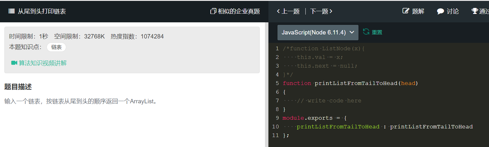

# 从尾到头打印链表
  

```
/*function ListNode(x){
    this.val = x;
    this.next = null;
}*/
function printListFromTailToHead(head)
{
    // write code here
    let out = [];
    let oth = head
    while(oth!=null){
        out.unshift(oth.val);
        oth=oth.next;
    };
    return out;
}
module.exports = {
    printListFromTailToHead : printListFromTailToHead
};
```

递归
```
function recursivePrint(node) {
  if (node && node.next) {
    console.log(recursivePrint(node.next));
  } else {
    console.log(node.element);
  }
}
```