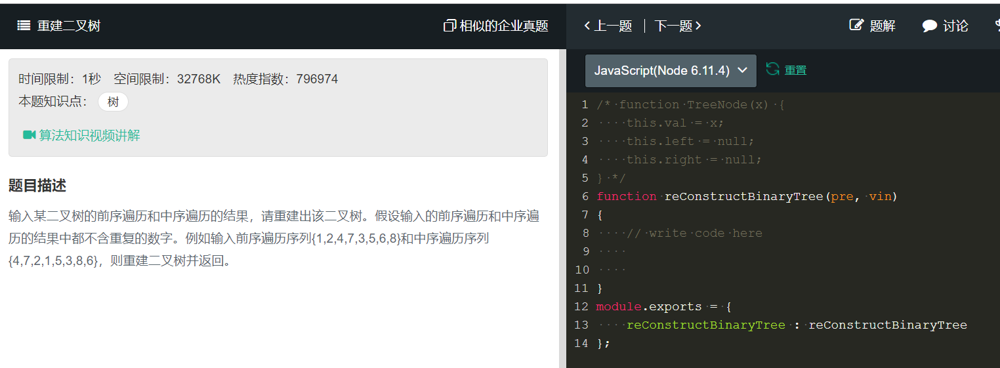

# 重建二叉树
    
  
有关树和链表的优先考虑递归。    
1. 确定根节点，然后分开左右树
2. 在左右树中分别递归
```
/* function TreeNode(x) {
    this.val = x;
    this.left = null;
    this.right = null;
} */
function reConstructBinaryTree(pre, vin)
{
    // write code here
    if(pre.length === 0 || vin.length === 0){
        return null;
    }

    //确定根节点位置
    const index = vin.indexOf(pre[0]),
    //分开左右树
    left = vin.slice(0,index),
    right = vin.slice(index+1);
    return {
        val:pre[0],
        left:reConstructBinaryTree(pre.slice(1,index+1),left),
        right:reConstructBinaryTree(pre.slice(index+1),right)
    };
    
}
module.exports = {
    reConstructBinaryTree : reConstructBinaryTree
};
```