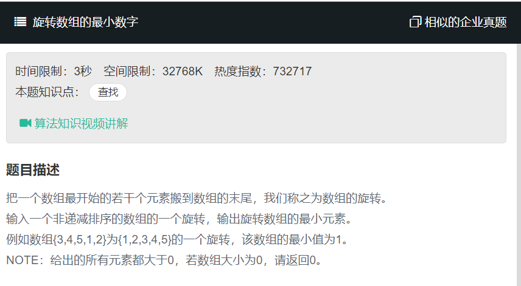

# 旋转数组的最小数字
  
  
1. 暴力循环

```
function minNumberInRotateArray(rotateArray)
{
    // write code here
    if(!rotateArray.length){
        return 0;
    }else{
        let temp = rotateArray[0];
        for(let i=1;i<rotateArray.length;i++){
            if(rotateArray[i]<temp){
                temp = rotateArray[i];
            }
        }
        return temp;
    }
}
```

2. 利用旋转数组的分界点就是最小值特性

```
function minNumberInRotateArray(rotateArray)
{
    // write code here
    if(!rotateArray.length){
        return 0;
    }else{
        for(let i=0;i<rotateArray.length;i++)
            if(rotateArray[i]>rotateArray[i+1]){
                return rotateArray[i+1];
            }
    }
}
```

3. 使用二分查找  
   使用二分查找，右半边递增时，最小元素在左半边。左半边递增时，最小元素在右半边。

```
function findMin(arr){
    if(!arr || !arr.length){
        return;
    }

    let lindex = 0,
    rindex = arr.length - 1,
    res = lindex;

    while(arr[lindex]>=arr[rindex]){
        if(rindex-lindex === 1){
            res = rindex;
        }

        res = (lindex+rindex)/2;

        //特殊情况
        if(arr[res]==arr[lindex] && arr[res]==arr[rindex]){
            return arr.reduce((min,val)=>{
                return Math.min(min,val);
            },arr[0]);
        }
        
        if(arr[res]>=arr[lindex]){
            lindex = res;
        }else if(arr[res]<=arr[rindex]){
            rindex = res;
        }
    }
    return arr[res];
}
```

```
function minNumberInRotateArray2(rotateArray) {
  let left = 0,
    right = rotateArray.length - 1;
  while (right - left > 1) {
    let mid = left + (right - left) >> 1;
    mid = left + (right - left >> 1);
    if (rotateArray[mid] > rotateArray[right]) {
      left = mid;
    } else {
      right = mid;
    }
  }
  return Math.min(rotateArray[left], rotateArray[right]);
}
```

```
function minNumberInRotateArray(rotateArray)
{
    // write code here
    let left = 0,
    right = rotateArray.length - 1;
  while (right - left > 1) {
    let mid = Math.floor((left+right)/2);
    if (rotateArray[mid] > rotateArray[right]) {
      left = mid;
    } else {
      right = mid;
    }
  }
  return Math.min(rotateArray[left], rotateArray[right]);
}
```