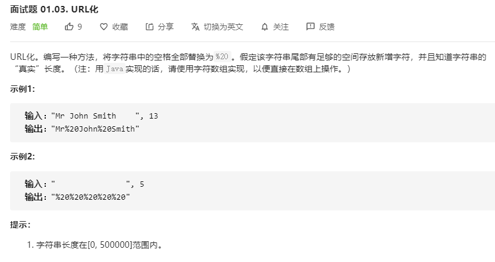

# 面试题 01.03. URL化
  

```
/**
 * @param {string} S
 * @param {number} length
 * @return {string}
 */
var replaceSpaces = function(S, length) {
    S = S.split('');
    while(S.length > length) {
        if(S[S.length-1] == ' ') {
            S.pop();
        } else if(S[0] == ' ') {
            S.unshift();
        }
    }

    S = S.join('').split(' ').join('%20')

    return S;
};
```